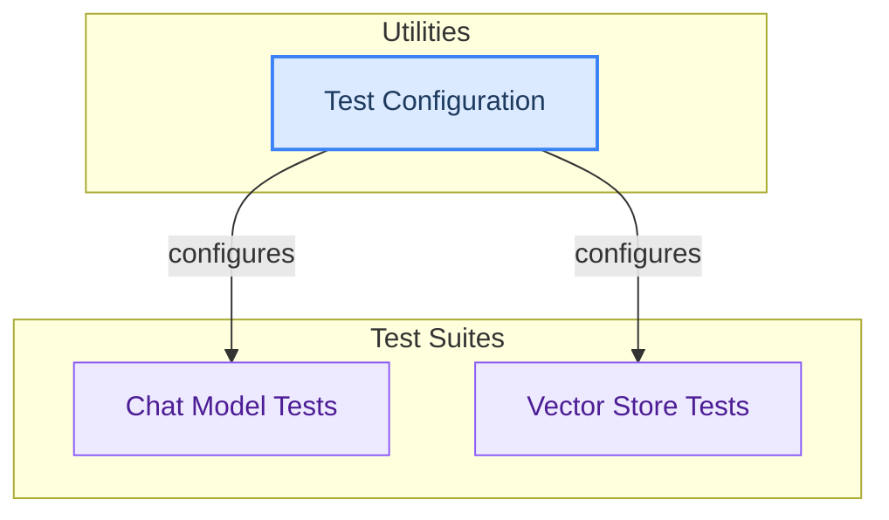

# Testing Utilities

This module provides a collection of base classes and fixtures for unit and integration testing of various LangChain components, including chat models and vector stores, ensuring their correct functionality and performance.

<!-- DIAGRAM_JSON
{
    "direction": "TD",
    "nodes": [
        {
            "id": "chat_model_tests",
            "label": "Chat Model Tests",
            "type": "module",
            "link": "chat_model_tests.md"
        },
        {
            "id": "vector_store_tests",
            "label": "Vector Store Tests",
            "type": "module",
            "link": "vector_store_tests.md"
        },
        {
            "id": "test_configuration",
            "label": "Test Configuration",
            "type": "module",
            "link": "test_configuration.md"
        }
    ],
    "edges": [
        {
            "source": "test_configuration",
            "target": "chat_model_tests",
            "label": "configures"
        },
        {
            "source": "test_configuration",
            "target": "vector_store_tests",
            "label": "configures"
        }
    ],
    "groups": [
        {
            "id": "test_suites",
            "label": "Test Suites",
            "role": "analytical",
            "nodes": [
                "chat_model_tests",
                "vector_store_tests"
            ]
        },
        {
            "id": "utilities",
            "label": "Utilities",
            "role": "surface",
            "nodes": [
                "test_configuration"
            ]
        }
    ]
}
-->
