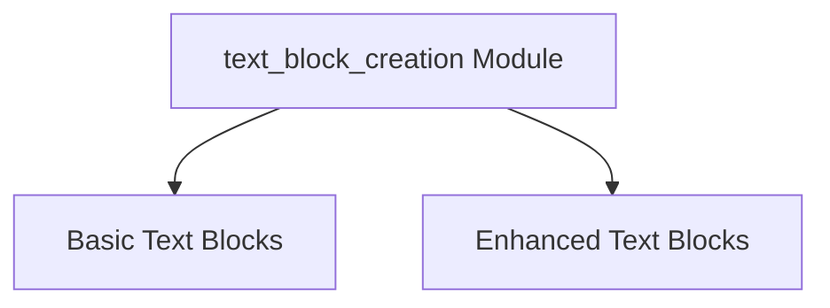

# text_block_creation Module Documentation

## Introduction and Purpose

The `text_block_creation` module is a specialized component within the [core_messages](core_messages.md) module, specifically focused on the creation of various text-based content blocks. It provides utility functions to construct standard text blocks, plaintext blocks with optional external sources (like URLs or base64 data), and dedicated reasoning/thought blocks. This module ensures consistent and structured representation of textual information within the larger LangChain system, facilitating clear communication and processing of language model outputs. It is a child of the [text_content_blocks](text_content_blocks.md) module.

## Architecture Overview

The `text_block_creation` module is logically divided into two sub-modules to organize its content block creation functionalities. These sub-modules encapsulate related functions, enhancing modularity and maintainability.

<!-- DIAGRAM_JSON
{
    "direction": "TD",
    "nodes": [
        {"id": "basic_text_blocks", "label": "Basic Text Blocks", "type": "module", "link": "basic_text_blocks.md"},
        {"id": "enhanced_text_blocks", "label": "Enhanced Text Blocks", "type": "module", "link": "enhanced_text_blocks.md"}
    ],
    "edges": [
        {"source": "text_block_creation", "target": "basic_text_blocks"},
        {"source": "text_block_creation", "target": "enhanced_text_blocks"}
    ],
    "groups": []
}
-->

## Sub-modules

### [Basic Text Blocks](basic_text_blocks.md)

This sub-module contains functions for creating fundamental text content blocks. It provides a straightforward way to encapsulate plain string data into a structured block, suitable for general text representation.

### [Enhanced Text Blocks](enhanced_text_blocks.md)

This sub-module focuses on creating more specialized text content blocks, including plaintext blocks that can incorporate external data references (e.g., URLs, base64 encoded strings) and dedicated reasoning blocks for expressing thought processes or summaries.