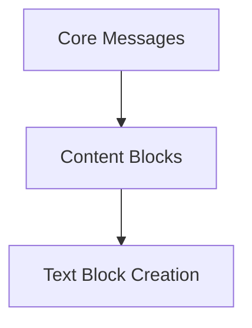

# Text Content Blocks

This module is responsible for defining and creating various types of text-based content blocks used within the LangChain framework. These blocks serve as fundamental building blocks for representing different forms of textual information, from simple strings to structured reasoning or plaintext files.

## Architecture Overview

The `text_content_blocks` module is a part of the broader [core_messages](messages.md) module, specifically nested under [content_blocks](content_blocks.md). It focuses exclusively on text-related content creation. The primary functionality is encapsulated within the `text_block_creation` sub-module, which provides functions for instantiating different text block types.

<!-- DIAGRAM_JSON
{
    "direction": "TD",
    "nodes": [
        {"id": "messages", "label": "Core Messages", "type": "module", "link": "messages.md"},
        {"id": "content_blocks", "label": "Content Blocks", "type": "module", "link": "content_blocks.md"},
        {"id": "text_block_creation", "label": "Text Block Creation", "type": "module", "link": "text_block_creation.md"}
    ],
    "edges": [
        {"source": "messages", "target": "content_blocks"},
        {"source": "content_blocks", "target": "text_block_creation"}
    ],
    "groups": []
}
-->

## Sub-modules

* [Text Block Creation](text_block_creation.md): Handles the creation of different text content block types.
