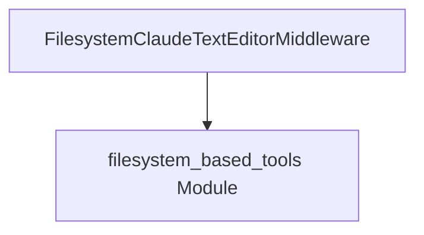

# `text_editor_tools`

The `text_editor_tools` module provides middleware for integrating a filesystem-based text editor tool within applications utilizing Anthropic's Claude models. This module allows applications to interact with files on the local filesystem, enabling operations such as reading, writing, and editing text files through a structured tool interface.

## Architecture and Core Components

The `text_editor_tools` module is a leaf module containing a single core component, `FilesystemClaudeTextEditorMiddleware`. This middleware facilitates the use of Anthropic's `text_editor` tool by mapping its operations to local filesystem interactions. It builds upon the foundational capabilities provided by the `filesystem_based_tools` module, which defines the base mechanisms for filesystem interaction within the Anthropic tool ecosystem.

<!-- DIAGRAM_JSON
{
    "direction": "TD",
    "nodes": [
        {"id": "text_editor_middleware", "label": "FilesystemClaudeTextEditorMiddleware", "type": "component", "link": null},
        {"id": "filesystem_based_tools", "label": "filesystem_based_tools Module", "type": "external", "link": "filesystem_based_tools.md"}
    ],
    "edges": [
        {"source": "text_editor_middleware", "target": "filesystem_based_tools"}
    ],
    "groups": []
}
-->


### Core Components

#### `FilesystemClaudeTextEditorMiddleware`

This class serves as the primary component of the `text_editor_tools` module. It is a specialized middleware designed to expose a `text_editor` tool interface that operates directly on the local filesystem. This allows applications to perform text editing operations, such as reading and writing file content, within a designated root directory.

**Purpose:**
*   To enable Anthropic's `text_editor` tool functionality using the local filesystem as the storage backend.
*   To provide a secure and controlled way to access and modify text files, with configurable root paths and allowed prefixes.

**Key Features:**
*   **Filesystem-based Storage**: Leverages the local filesystem for all file operations, meaning users are responsible for managing persistence (e.g., via volumes or version control like Git).
*   **Root Path Configuration**: Allows defining a `root_path` to restrict file operations to a specific directory, enhancing security and preventing unintended access to other parts of the filesystem.
*   **Allowed Prefixes**: Further restricts access by allowing only specific virtual path `allowed_prefixes`, defaulting to all paths within the `root_path` if not specified.
*   **Maximum File Size Limit**: Prevents processing excessively large files by enforcing a `max_file_size_mb` limit, defaulting to 10 MB.

**Relationship to other modules:**
The `FilesystemClaudeTextEditorMiddleware` inherits from `_FilesystemClaudeFileToolMiddleware`, which is defined in the [filesystem_based_tools module](filesystem_based_tools.md). This inheritance provides the fundamental file manipulation capabilities and ensures consistent behavior with other filesystem-based tools in the Anthropic middleware suite. It utilizes internal constants for `tool_type` and `tool_name` to identify itself as a text editor tool.

**Example Usage:**

```python
from langchain.agents import create_agent
from langchain.agents.middleware import FilesystemTextEditorToolMiddleware # Note: This example uses a simplified import path for demonstration.

# Assuming 'model' is an initialized language model instance
agent = create_agent(
    model=model,
    tools=[], # Other tools can be added here
    middleware=[FilesystemTextEditorToolMiddleware(root_path="/workspace")],
)

# The agent can now use the 'text_editor' tool to interact with files
# within the /workspace directory.
```
