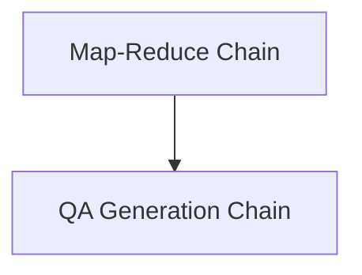

# Text Processing Chains Module Documentation

## Introduction

The `text_processing_chains` module provides core functionalities for advanced text manipulation and processing within the system. It includes implementations for common natural language processing patterns such as Map-Reduce for large text summarization and Question-Answer generation from given contexts.

## Architecture Overview

This module is composed of several key sub-modules that work together to enable efficient text processing. The architecture is designed to be modular and extensible, allowing for easy integration of new processing chains and techniques.

<!-- DIAGRAM_JSON
{
    "direction": "TD",
    "nodes": [
        {"id": "map_reduce_chain_module", "label": "Map-Reduce Chain", "type": "module", "link": "map_reduce_chain_module.md"},
        {"id": "qa_generation_chain_module", "label": "QA Generation Chain", "type": "module", "link": "qa_generation_chain_module.md"}
    ],
    "edges": [
        {"source": "map_reduce_chain_module", "target": "qa_generation_chain_module", "label": "can inform"}
    ],
    "groups": []
}
-->

## Sub-modules

### [Map-Reduce Chain](map_reduce_chain_module.md)

This sub-module implements the Map-Reduce pattern for processing large textual inputs. It enables splitting documents into smaller chunks, processing each chunk independently (map phase), and then combining the results into a concise output (reduce phase). It is particularly useful for summarization, data extraction, and other tasks requiring distributed processing of text.

### [QA Generation Chain](qa_generation_chain_module.md)

The QA Generation Chain sub-module is designed to automatically generate question-answer pairs from a given text. It leverages language models and text splitting techniques to identify key information and formulate relevant questions and answers, facilitating tasks like content comprehension and automated quiz generation.
