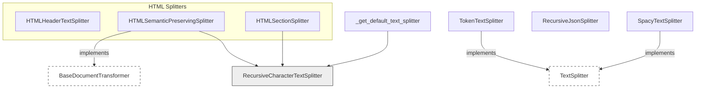

# text_splitters
The `text_splitters` module offers diverse strategies for segmenting text, HTML, and JSON content. It provides specialized classes for token-based, HTML structure-aware, JSON hierarchy-preserving, and Spacy-driven text splitting.

<!-- DIAGRAM_JSON
{
  "nodes": [
    {"id": "_get_default_text_splitter", "label": "_get_default_text_splitter", "type": "function"},
    {"id": "TokenTextSplitter", "label": "TokenTextSplitter", "type": "class"},
    {"id": "HTMLHeaderTextSplitter", "label": "HTMLHeaderTextSplitter", "type": "class"},
    {"id": "HTMLSemanticPreservingSplitter", "label": "HTMLSemanticPreservingSplitter", "type": "class"},
    {"id": "HTMLSectionSplitter", "label": "HTMLSectionSplitter", "type": "class"},
    {"id": "RecursiveJsonSplitter", "label": "RecursiveJsonSplitter", "type": "class"},
    {"id": "SpacyTextSplitter", "label": "SpacyTextSplitter", "type": "class"},
    {"id": "TextSplitter", "label": "TextSplitter", "type": "interface"},
    {"id": "BaseDocumentTransformer", "label": "BaseDocumentTransformer", "type": "interface"},
    {"id": "RecursiveCharacterTextSplitter", "label": "RecursiveCharacterTextSplitter", "type": "class"}
  ],
  "edges": [
    {"source": "TokenTextSplitter", "target": "TextSplitter", "type": "inherits"},
    {"source": "SpacyTextSplitter", "target": "TextSplitter", "type": "inherits"},
    {"source": "HTMLSemanticPreservingSplitter", "target": "BaseDocumentTransformer", "type": "inherits"},
    {"source": "_get_default_text_splitter", "target": "RecursiveCharacterTextSplitter", "type": "uses"},
    {"source": "HTMLSemanticPreservingSplitter", "target": "RecursiveCharacterTextSplitter", "type": "uses"},
    {"source": "HTMLSectionSplitter", "target": "RecursiveCharacterTextSplitter", "type": "uses"}
  ],
  "groups": [
    {"id": "html_splitters", "label": "HTML Splitters", "nodes": ["HTMLHeaderTextSplitter", "HTMLSemanticPreservingSplitter", "HTMLSectionSplitter"]}
  ]
}
-->
```
