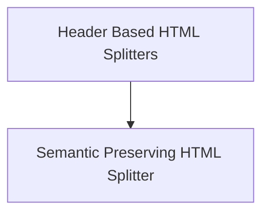

# `text_splitters_html` Module Documentation

The `text_splitters_html` module provides various strategies for splitting HTML content into manageable and semantically meaningful chunks. It offers specialized tools for processing HTML documents, extracting relevant text, and preserving structural integrity.

## Architecture Overview

The module is composed of two main sub-modules:

1.  **Header Based HTML Splitters**: Focuses on splitting HTML documents based on their header tags, creating a hierarchical representation.
2.  **Semantic Preserving HTML Splitter**: Provides advanced splitting capabilities that preserve the semantic structure of HTML, including handling media elements and links.

<!-- DIAGRAM_JSON
{
    "direction": "TD",
    "nodes": [
        {"id": "header_based_splitters", "label": "Header Based HTML Splitters", "type": "module", "link": "header_based_splitters.md"},
        {"id": "semantic_preserving_splitter", "label": "Semantic Preserving HTML Splitter", "type": "module", "link": "semantic_preserving_splitter.md"}
    ],
    "edges": [
        {"source": "header_based_splitters", "target": "semantic_preserving_splitter"}
    ],
    "groups": []
}
-->

## Sub-modules

### [Header Based HTML Splitters](header_based_splitters.md)

This sub-module contains utilities for splitting HTML content specifically by its header tags (e.g., `<h1>`, `<h2>`). It is designed to extract text while maintaining the hierarchy defined by these headers, useful for creating structured documents from web pages.

### [Semantic Preserving HTML Splitter](semantic_preserving_splitter.md)

The `semantic_preserving_splitter` sub-module offers a more sophisticated approach to HTML splitting. It intelligently breaks down HTML content into chunks, ensuring that the semantic meaning and structural elements like links, images, and videos are preserved. It also allows for recursive splitting of larger chunks when necessary.