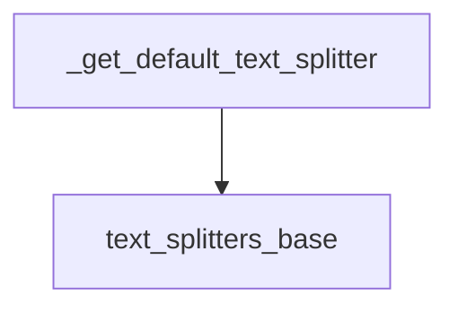

# `text_splitting_utilities` Module Documentation

The `text_splitting_utilities` module provides a default text splitting mechanism crucial for processing documents before they are indexed or stored in vector databases. This module ensures that documents are broken down into manageable chunks, optimizing retrieval and contextual understanding within language model applications.

### Module Purpose and Core Functionality

The primary purpose of the `text_splitting_utilities` module is to offer a standardized, default `TextSplitter` instance. This instance, specifically a `RecursiveCharacterTextSplitter`, is configured with sensible defaults (e.g., `chunk_size=1000`, `chunk_overlap=0`) to facilitate efficient document chunking. This functionality is essential for preparing large texts for systems that require input of a specific size, such as vector stores.

The module currently exposes one core function:

*   `_get_default_text_splitter`: This function returns a `RecursiveCharacterTextSplitter` configured for general-purpose text splitting. It acts as a factory for consistent text splitter instances across the system.

### Architecture and Component Relationships

The `text_splitting_utilities` module is a leaf module within the `classic_indexes.vectorstore` module, indicating its role as a utility provider for vector store indexing operations. Its main internal component, `_get_default_text_splitter`, relies on external text splitting classes and interfaces.

<!-- DIAGRAM_JSON
{
    "direction": "TD",
    "nodes": [
        {"id": "get_default_text_splitter", "label": "_get_default_text_splitter", "type": "component", "link": null},
        {"id": "text_splitters_base", "label": "text_splitters_base", "type": "external", "link": "text_splitters_base.md"}
    ],
    "edges": [
        {"source": "get_default_text_splitter", "target": "text_splitters_base"}
    ],
    "groups": []
}
-->

### How the Module Fits into the Overall System

The `text_splitting_utilities` module plays a foundational role in the data preparation pipeline for vector stores within the LangChain Classic framework. By providing a default text splitter, it ensures that documents are consistently and appropriately chunked before being embedded and stored. This is critical for:

*   **Vector Store Indexing**: Documents are split into smaller, semantically coherent chunks, which are then individually embedded and stored. This allows for more granular and accurate retrieval.
*   **Retrieval Augmented Generation (RAG)**: When querying a vector store, the smaller document chunks returned by the splitter are more likely to fit into the context window of a language model, improving the relevance and quality of generated responses.

The module's dependency on the `text_splitters_base` module highlights its reliance on the core abstractions for text splitting, ensuring extensibility and adherence to established patterns. While this module provides a default, other specialized text splitters (e.g., HTML, JSON, Spacy splitters from `text_splitters_html`, `text_splitters_json`, `text_splitters_spacy` modules, respectively) can be used for more specific use cases.

Overall, `text_splitting_utilities` serves as a convenient and essential component for managing document size and structure, thereby enhancing the performance and utility of vector-based information retrieval systems.