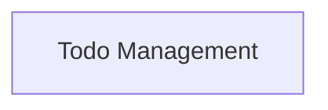

# Todo List Middleware Module

## Introduction

The `todo_list` module provides a robust middleware solution for agents to manage structured task lists (todos). It enables agents to break down complex problems into manageable steps, track progress, and communicate task status effectively. This module is essential for agents performing multi-step operations, ensuring organization and transparency in their execution.

## Architecture Overview

The `todo_list` module primarily consists of the `TodoListMiddleware` and its associated functions for writing and managing todos. It integrates into an agent's workflow by injecting system prompts and providing a specialized tool for todo list manipulation. The middleware enforces rules around todo list updates to maintain data consistency.

<!-- DIAGRAM_JSON
{
    "direction": "TD",
    "nodes": [
        {"id": "todo_management", "label": "Todo Management", "type": "module", "link": "todo_management.md"}
    ],
    "edges": [],
    "groups": []
}
-->

## Sub-modules

### [Todo Management](todo_management.md)

This sub-module contains the core logic for the `TodoListMiddleware`, which allows agents to create and manage structured task lists. It includes the `TodoListMiddleware` class, responsible for injecting todo-related system prompts and enforcing single-call updates, as well as the `write_todos` and `_awrite_todos` functions that agents use to interact with and update their todo lists.
