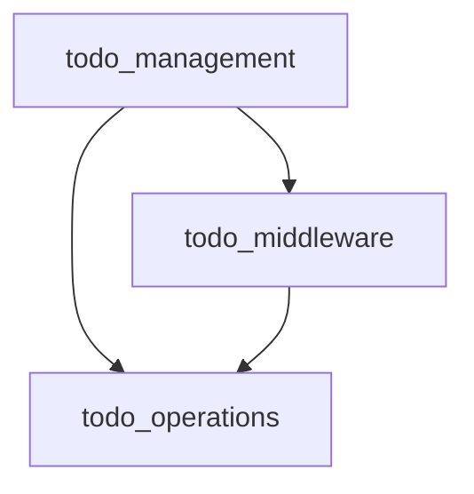

# Todo Management Module

## Introduction
The `todo_management` module provides robust capabilities for agents to create, manage, and track structured task lists. It integrates seamlessly into an agent's workflow by injecting system prompts that guide the agent on effective todo list utilization and offering tools to update the task status. This module is essential for agents handling complex, multi-step operations, as it enhances task organization, progress tracking, and transparency for users.

## Architecture Overview
The `todo_management` module is composed of two main sub-modules:
- `todo_middleware`: Handles the core logic of injecting the todo tool and enforcing its usage policies.
- `todo_operations`: Contains the functions responsible for updating the todo list.

<!-- DIAGRAM_JSON
{
    "direction": "TD",
    "nodes": [
        {"id": "todo_middleware", "label": "Todo List Middleware", "type": "module", "link": "todo_middleware.md"},
        {"id": "todo_operations", "label": "Todo List Operations", "type": "module", "link": "todo_operations.md"}
    ],
    "edges": [
        {"source": "todo_middleware", "target": "todo_operations"}
    ],
    "groups": []
}
-->

## Sub-modules

### [Todo List Middleware](todo_middleware.md)
This sub-module, primarily through the `TodoListMiddleware` class, injects the `write_todos` tool into the agent's environment. It manages the system prompts that guide the agent in using the todo functionality and enforces rules such as allowing only one `write_todos` call per model turn to maintain consistency.

### [Todo List Operations](todo_operations.md)
This sub-module contains the core functions, `write_todos` and `_awrite_todos`, which are responsible for the actual creation and modification of the structured todo list. These functions are exposed to the agent as a tool, allowing for dynamic task management.