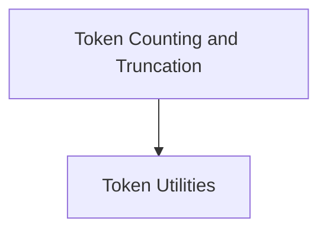

# Token Counting and Truncation Module

## Introduction
This module provides essential functionalities for managing token counts and truncating message sequences within the LangChain Core. It plays a crucial role in controlling the size of inputs to language models, preventing overflow, and optimizing token usage.

## Architecture Overview
The `token_counting_and_truncation` module is a focused component within the larger `core_messages` utility ecosystem. It directly interacts with the `message_utils` sub-module to provide core token management capabilities.

<!-- DIAGRAM_JSON
{
    "direction": "TD",
    "nodes": [
        {"id": "token_utils", "label": "Token Utilities", "type": "module", "link": "token_utils.md"}
    ],
    "edges": []
}
-->

## Sub-modules

*   **[Token Utilities](token_utils.md)**: This sub-module, detailed in its dedicated documentation, encapsulates the logic for approximating token counts and truncating message sequences to adhere to specified token limits. It includes functions for efficiently calculating token usage and ensuring that message arrays do not exceed maximum token thresholds.
