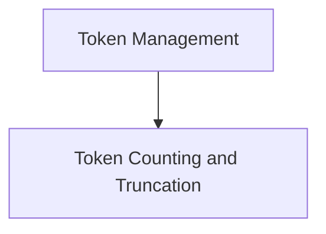

# Token Management Module

## Introduction
The `token_management` module provides essential utilities for handling token limits and managing message sequences within language model applications. Its primary functions include approximating token counts and truncating messages to adhere to specified token constraints, crucial for optimizing API calls and ensuring efficient processing.

## Architecture
The `token_management` module is structured around core functionalities related to token handling. It primarily consists of the `token_counting_and_truncation` sub-module, which encapsulates the logic for counting and managing tokens.

<!-- DIAGRAM_JSON
{
    "direction": "TD",
    "nodes": [
        {"id": "token_management", "label": "Token Management", "type": "module", "link": "token_management.md"},
        {"id": "token_counting_and_truncation", "label": "Token Counting and Truncation", "type": "module", "link": "token_counting_and_truncation.md"}
    ],
    "edges": [
        {"source": "token_management", "target": "token_counting_and_truncation"}
    ],
    "groups": []
}
-->

## Sub-modules

### [Token Counting and Truncation](token_counting_and_truncation.md)
This sub-module provides utilities for approximating token counts in message sequences and truncating those sequences to fit within a specified maximum token limit. This is vital for managing input to language models, preventing overflow, and optimizing token usage.
