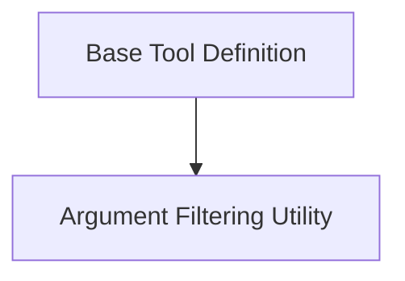

# Tool Base Module

## Introduction and Purpose

The `tool_base` module defines the foundational components for creating and managing tools within the LangChain framework. It establishes the abstract `BaseTool` class, which all specific tool implementations must inherit from, ensuring a consistent interface and behavior across different tools. This module also provides utilities for argument processing and schema management, crucial for robust tool integration and execution within agent systems.

## Architecture Overview

The `tool_base` module is structured around its core `BaseTool` class and supplementary argument handling utilities. The `BaseTool` serves as the central abstract class, defining the contract for all tools. The `argument_filtering` utility assists in processing tool inputs by filtering out specific arguments, contributing to the overall robustness of tool execution.

<!-- DIAGRAM_JSON
{
    "direction": "TD",
    "nodes": [
        {"id": "base_tool_definition", "label": "Base Tool Definition", "type": "module", "link": "base_tool_definition.md"},
        {"id": "argument_filtering", "label": "Argument Filtering Utility", "type": "module", "link": "argument_filtering.md"}
    ],
    "edges": [
        {"source": "base_tool_definition", "target": "argument_filtering"}
    ],
    "groups": []
}
-->

## High-Level Functionality

### [Base Tool Definition](base_tool_definition.md)
This sub-module contains the `BaseTool` abstract class, which is the cornerstone for all tools in LangChain. It provides methods for input parsing, validation, and execution, as well as handling callbacks and error management.

### [Argument Filtering Utility](argument_filtering.md)
This sub-module offers a utility function to extract and filter arguments from tool functions, ensuring that only relevant parameters are passed during tool invocation.
