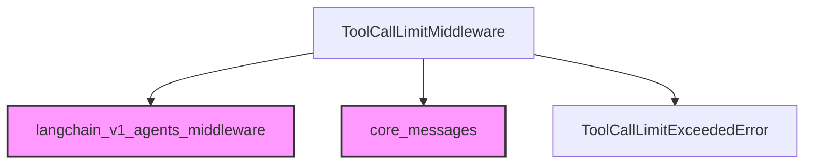

# Module: tool_call_limit

The `tool_call_limit` module provides a powerful middleware component, `ToolCallLimitMiddleware`, designed to manage and enforce limits on the number of tool calls made during the execution of an agent. This is crucial for controlling resource usage, preventing infinite loops, and ensuring predictable agent behavior.

## Core Functionality

The primary component of this module is `ToolCallLimitMiddleware`. This middleware tracks tool calls at both the thread level (persistent across multiple agent runs within the same thread) and the run level (reset for each new invocation of the agent). It allows for granular control, enabling limits to be applied to specific tools or to all tools universally.

### `ToolCallLimitMiddleware`

The `ToolCallLimitMiddleware` offers the following key features:

-   **Flexible Limiting**: Configure maximum tool calls per thread (`thread_limit`) or per individual agent run (`run_limit`). If both are set, the more restrictive limit applies.
-   **Tool-Specific or Global Limits**: Apply limits to a named tool (`tool_name`) or to all tools if `tool_name` is `None`.
-   **Configurable Exit Behaviors**: Determine how the middleware reacts when a limit is exceeded:
    -   `'continue'` (default): Blocks the specific tool calls that exceed the limit, returning an error message for those calls, but allows other tools and the model to continue execution.
    -   `'error'`: Raises a `ToolCallLimitExceededError` exception, immediately stopping execution. This is suitable for strict enforcement.
    -   `'end'`: Stops the agent's execution immediately with an AI message indicating the limit has been reached. This behavior is designed for scenarios where only a single tool call would exceed the limit and no other parallel tool calls are pending.
-   **Asynchronous Support**: Provides both synchronous (`after_model`) and asynchronous (`aafter_model`) hooks to integrate seamlessly into agent runtimes.

### When to use `ToolCallLimitMiddleware`

This middleware is particularly useful in scenarios where:
-   You need to prevent agents from making excessive or unintended tool calls, which can lead to high costs or resource exhaustion.
-   You want to build agents that operate within predefined constraints.
-   You are debugging agent behavior and want to isolate issues related to tool invocation frequency.

## Architecture and Component Relationships

The `tool_call_limit` module is a leaf module within the `langchain_v1_agents_middleware` package, focusing solely on the logic for tool call limiting. It extends the base `AgentMiddleware` and interacts with message types defined in `core_messages` to manage and respond to tool invocations.

<!-- DIAGRAM_JSON
{
    "direction": "TD",
    "nodes": [
        {"id": "tool_call_limit_middleware", "label": "ToolCallLimitMiddleware", "type": "component", "link": null},
        {"id": "tool_call_limit_exceeded_error", "label": "ToolCallLimitExceededError", "type": "component", "link": null},
        {"id": "langchain_v1_agents_middleware", "label": "langchain_v1_agents_middleware", "type": "external", "link": "langchain_v1_agents_middleware.md"},
        {"id": "core_messages", "label": "core_messages", "type": "external", "link": "core_messages.md"}
    ],
    "edges": [
        {"source": "tool_call_limit_middleware", "target": "langchain_v1_agents_middleware"},
        {"source": "tool_call_limit_middleware", "target": "core_messages"},
        {"source": "tool_call_limit_middleware", "target": "tool_call_limit_exceeded_error"}
    ],
    "groups": []
}
-->

### Relationships

-   `ToolCallLimitMiddleware` **inherits from** `AgentMiddleware` (from [langchain_v1_agents_middleware](langchain_v1_agents_middleware.md)): It extends the base middleware class to implement its specific tool call limiting logic.
-   `ToolCallLimitMiddleware` **interacts with** `AIMessage` and `ToolMessage` (from [core_messages](core_messages.md)): It inspects `AIMessage` for outgoing tool calls and generates `ToolMessage` instances (either for errors or to indicate blocked calls) to manage the agent's response.
-   `ToolCallLimitMiddleware` **raises** `ToolCallLimitExceededError`: This custom exception is raised when the `exit_behavior` is set to `'error'`, providing clear feedback about why the limit was exceeded.

## Integration with the Overall System

The `tool_call_limit` module is an integral part of the agent middleware ecosystem within LangChain. By being a pluggable `AgentMiddleware` component, it can be easily integrated into any agent definition to add a layer of control over tool invocation. It ensures that agents adhere to predefined operational boundaries, contributing to the stability, cost-effectiveness, and reliability of AI-powered applications. Its position within the `langchain_v1_agents_middleware` sub-module highlights its role as a cross-cutting concern that can be applied to various agent types to govern their tool usage.
