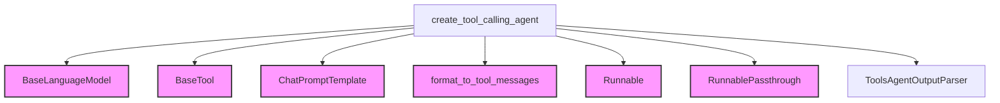

# `tool_calling_agents`

The `tool_calling_agents` module provides functionality for creating agents that can interact with external tools. This module is a specialized agent type within the `classic_agents` family, designed to facilitate tool-augmented conversational capabilities.

## Core Functionality

The primary function in this module is `create_tool_calling_agent`, which constructs a runnable agent capable of leveraging provided tools.

### `create_tool_calling_agent`

`create_tool_calling_agent(llm, tools, prompt, *, message_formatter=format_to_tool_messages)`

This function creates an agent that uses a language model to decide which tools to call and what inputs to provide, based on the conversation history and the current input.

*   **`llm`**: The Language Model (LLM) that will serve as the agent's brain. This LLM must implement a `bind_tools()` method to enable tool interaction.
*   **`tools`**: A sequence of `BaseTool` instances that the agent has access to. These tools represent specific actions or functionalities the agent can perform.
*   **`prompt`**: The `ChatPromptTemplate` used to guide the agent's behavior. It is crucial that the prompt includes an `agent_scratchpad` key (as a `MessagesPlaceholder`) to incorporate intermediate agent actions and tool outputs.
*   **`message_formatter`**: (Optional) A formatter function that converts agent actions and tool outputs into `FunctionMessage` objects, which are then passed into the `agent_scratchpad`. Defaults to `format_to_tool_messages` from `agent_format_scratchpad`.

**Returns**:
A `Runnable` sequence representing the agent. This runnable takes the same input variables as the provided prompt and returns either an `AgentAction` (indicating a tool call) or an `AgentFinish` (indicating the completion of the task).

**Example Usage**:

```python
from langchain_classic.agents import (
    AgentExecutor,
    create_tool_calling_agent,
    tool,
)
from langchain_anthropic import ChatAnthropic
from langchain_core.prompts import ChatPromptTemplate
from langchain_core.messages import AIMessage, HumanMessage

prompt = ChatPromptTemplate.from_messages(
    [
        ("system", "You are a helpful assistant"),
        ("placeholder", "{chat_history}"),
        ("human", "{input}"),
        ("placeholder", "{agent_scratchpad}"),
    ]
)
model = ChatAnthropic(model="claude-opus-4-1-20250805")

@tool
def magic_function(input: int) -> int:
    """Applies a magic function to an input."""
    return input + 2

tools = [magic_function]

agent = create_tool_calling_agent(model, tools, prompt)
agent_executor = AgentExecutor(agent=agent, tools=tools, verbose=True)

agent_executor.invoke({"input": "what is the value of magic_function(3)?"})

# Using with chat history
agent_executor.invoke(
    {
        "input": "what's my name?",
        "chat_history": [
            HumanMessage(content="hi! my name is bob"),
            AIMessage(content="Hello Bob! How can I assist you today?"),
        ],
    }
)
```

**Prompt Requirements**:
The agent prompt **must** include an `agent_scratchpad` key as a `MessagesPlaceholder`. This placeholder is essential for the agent to track its intermediate actions and tool outputs.

**Troubleshooting**:
If `invalid_tool_calls` errors occur, verify that tool functions return properly formatted and JSON-serializable responses. Custom objects used in tool outputs should implement `__str__` or `to_dict` methods.

## Architecture and Component Relationships

The `tool_calling_agents` module integrates several core LangChain components to create a robust tool-calling agent.

<!-- DIAGRAM_JSON
{
    "direction": "TD",
    "nodes": [
        {"id": "create_tool_calling_agent", "label": "create_tool_calling_agent", "type": "component", "link": null},
        {"id": "tools_agent_output_parser", "label": "ToolsAgentOutputParser", "type": "component", "link": null},
        {"id": "base_language_model", "label": "BaseLanguageModel", "type": "external", "link": "core_language_models.md"},
        {"id": "base_tool", "label": "BaseTool", "type": "external", "link": "core_tools.md"},
        {"id": "chat_prompt_template", "label": "ChatPromptTemplate", "type": "external", "link": "core_prompts.md"},
        {"id": "format_to_tool_messages", "label": "format_to_tool_messages", "type": "external", "link": "agent_format_scratchpad.md"},
        {"id": "runnable", "label": "Runnable", "type": "external", "link": "base_runnables.md"},
        {"id": "runnable_passthrough", "label": "RunnablePassthrough", "type": "external", "link": "passthrough_runnables.md"}
    ],
    "edges": [
        {"source": "create_tool_calling_agent", "target": "base_language_model"},
        {"source": "create_tool_calling_agent", "target": "base_tool"},
        {"source": "create_tool_calling_agent", "target": "chat_prompt_template"},
        {"source": "create_tool_calling_agent", "target": "format_to_tool_messages"},
        {"source": "create_tool_calling_agent", "target": "runnable"},
        {"source": "create_tool_calling_agent", "target": "runnable_passthrough"},
        {"source": "create_tool_calling_agent", "target": "tools_agent_output_parser"}
    ],
    "groups": []
}
-->


## Integration with the Overall System

The `tool_calling_agents` module is a vital part of the [classic_agents](classic_agents.md) ecosystem, specifically falling under the [specialized_agents](specialized_agents.md) category. It provides a concrete implementation for agents that can dynamically select and invoke tools based on the ongoing conversation.

It relies on core components from [core_language_models](core_language_models.md) for its LLM capabilities, [core_tools](core_tools.md) for tool definitions, and [core_prompts](core_prompts.md) for constructing the conversational context. The agent's execution flow is built using the [core_runnables](core_runnables.md) framework, leveraging `RunnablePassthrough` from [passthrough_runnables](passthrough_runnables.md) and returning a `Runnable` from [base_runnables](base_runnables.md). The `message_formatter` dependency comes from [agent_format_scratchpad](agent_format_scratchpad.md).

This module enables developers to build sophisticated AI assistants that can perform complex tasks requiring external interactions, making it a cornerstone for creating intelligent, action-oriented applications within the LangChain framework.
