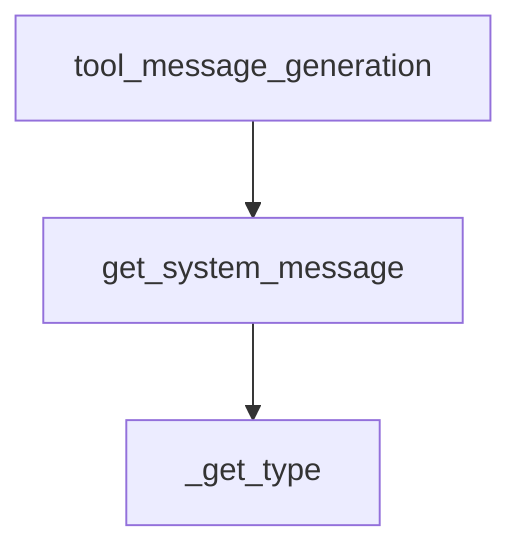

This document provides comprehensive documentation for the `tool_description_generation` module, detailing its purpose, architecture, and how it integrates into the broader system.

### Introduction

The `tool_description_generation` module is a vital component within the `partners_anthropic_experimental` package, specifically designed to facilitate the integration of tools with Anthropic's language models. Its primary function is to generate well-formatted system messages that clearly describe the available tools and their parameters, enabling the models to understand and utilize these tools effectively.

### Module Architecture and Component Relationships

The `tool_description_generation` module focuses on the `get_system_message` function, which is responsible for constructing the tool-description system message. This function processes raw tool definitions and formats them according to predefined templates, ensuring consistency and clarity for the language model.

<!-- DIAGRAM_JSON
{
    "direction": "TD",
    "nodes": [
        {"id": "get_system_message", "label": "get_system_message", "type": "component", "link": null},
        {"id": "_get_type", "label": "_get_type", "type": "component", "link": null},
        {"id": "tool_message_generation", "label": "tool_message_generation", "type": "external", "link": "tool_message_generation.md"}
    ],
    "edges": [
        {"source": "get_system_message", "target": "_get_type"},
        {"source": "tool_message_generation", "target": "get_system_message"}
    ],
    "groups": []
}
-->

#### Core Components

*   **`get_system_message(tools: list[dict]) -> str`**
    *   **Purpose:** This is the main function of the module. It takes a list of tool dictionaries, extracts their names, descriptions, and parameters, and formats them into a comprehensive system message string. This string is then used as input to Anthropic models, instructing them on how to interact with the provided tools.
    *   **Details:** The function iterates through each tool, and for each tool, it further iterates through its parameters. It uses internal formatting constants (`TOOL_PARAMETER_FORMAT`, `TOOL_FORMAT`, `SYSTEM_PROMPT_FORMAT`) and a helper function (`_get_type`) to construct the final message.
    *   **Dependencies:**
        *   `_get_type`: A helper function (likely internal to the module or a closely related utility) that determines the type of a tool parameter for formatting.
        *   `TOOL_PARAMETER_FORMAT`, `TOOL_FORMAT`, `SYSTEM_PROMPT_FORMAT`: String constants used for consistent formatting of the tool descriptions within the system message.

### System Integration

The `tool_description_generation` module is a sub-module of `tool_message_generation` within the `partners_anthropic_experimental` package. It plays a crucial role in enabling Anthropic models to utilize external tools by providing a structured and understandable description of these tools.

*   **Role in `tool_message_generation`:** This module's output, the generated system message, is a key input for the `tool_message_generation` module, which likely combines this information with other context to formulate complete prompts for Anthropic models.
*   **Interaction with Anthropic Models:** The system messages generated by this module are designed to be directly consumed by Anthropic's chat models, enhancing their ability to perform tool-augmented generation and understand when and how to call specific functions.
*   **Experimental Nature:** As indicated by its placement within `partners_anthropic_experimental`, this module is part of an experimental feature set, suggesting ongoing development and potential future refinements in how tools are described and integrated with Anthropic's offerings.