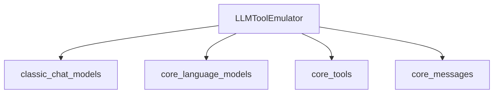

# tool_emulation Module Documentation

The `tool_emulation` module provides the `LLMToolEmulator` middleware, a crucial component for testing and developing agents that interact with tools. It allows developers to simulate tool executions using a Language Model (LLM) instead of performing actual tool calls. This is particularly useful for rapid prototyping, isolating agent logic from external tool dependencies, and controlled testing environments.

<!-- DIAGRAM_JSON
{
    "direction": "TD",
    "nodes": [
        {"id": "llm_tool_emulator", "label": "LLMToolEmulator", "type": "component", "link": null},
        {"id": "classic_chat_models", "label": "classic_chat_models", "type": "external", "link": "classic_chat_models.md"},
        {"id": "core_language_models", "label": "core_language_models", "type": "external", "link": "core_language_models.md"},
        {"id": "core_tools", "label": "core_tools", "type": "external", "link": "core_tools.md"},
        {"id": "core_messages", "label": "core_messages", "type": "external", "link": "core_messages.md"}
    ],
    "edges": [
        {"source": "llm_tool_emulator", "target": "classic_chat_models"},
        {"source": "llm_tool_emulator", "target": "core_language_models"},
        {"source": "llm_tool_emulator", "target": "core_tools"},
        {"source": "llm_tool_emulator", "target": "core_messages"}
    ],
    "groups": []
}
-->



## Core Functionality

### LLMToolEmulator

The `LLMToolEmulator` class is an `AgentMiddleware` that intercepts tool calls and, if configured, replaces their execution with a response generated by an LLM. This provides a flexible way to mock tool interactions.

**Key Features:**

*   **Selective Emulation**: Emulate all tools, specific tools by name, or specific `BaseTool` instances.
*   **Customizable Emulator Model**: Use a default Anthropic model or provide a custom `BaseChatModel` instance or model identifier string for generating emulated responses.
*   **Realistic Responses**: The emulator LLM generates realistic output based on the tool's name, description, and arguments, introducing variation in responses.

**Class Definition:**

```python
class LLMToolEmulator(AgentMiddleware[AgentState[Any], ContextT], Generic[ContextT]):
    # ... (simplified for documentation)
```

#### `__init__` Method

Initializes the `LLMToolEmulator`.

```python
def __init__(
    self,
    *,
    tools: list[str | BaseTool] | None = None,
    model: str | BaseChatModel | None = None,
) -> None:
```

*   **`tools`** (`list[str | BaseTool] | None`): A list of tool names (strings) or `BaseTool` instances to be emulated.
    *   If `None` (default), all tools will be emulated.
    *   If an empty list, no tools will be emulated, and the middleware will act as a passthrough.
*   **`model`** (`str | BaseChatModel | None`): The LLM to use for generating emulated tool responses.
    *   Defaults to `'anthropic:claude-sonnet-4-5-20250929'`.
    *   Can be a model identifier string (e.g., `'openai:gpt-4o'`) or an instance of `BaseChatModel`.

#### `wrap_tool_call` Method

Synchronously intercepts and potentially emulates a tool call.

```python
def wrap_tool_call(
    self,
    request: ToolCallRequest,
    handler: Callable[[ToolCallRequest], ToolMessage | Command[Any]],
) -> ToolMessage | Command[Any]:
```

*   **`request`** (`ToolCallRequest`): The incoming tool call request.
*   **`handler`** (`Callable[[ToolCallRequest], ToolMessage | Command[Any]]`): A callable that, when invoked, executes the actual tool. This is called if the tool should not be emulated.
*   **Returns**: A `ToolMessage` containing the emulated response if the tool is emulated, or the result of calling the `handler` for normal execution.

If the tool specified in `request` is configured for emulation, a prompt is constructed using the tool's name, description, and arguments. This prompt is then sent to the internal `model` to generate a realistic tool output, which is returned as a `ToolMessage`. Otherwise, the `handler` is called to proceed with the actual tool execution.

#### `awrap_tool_call` Method

Asynchronously intercepts and potentially emulates a tool call. This is the asynchronous counterpart to `wrap_tool_call`.

```python
async def awrap_tool_call(
    self,
    request: ToolCallRequest,
    handler: Callable[[ToolCallRequest], Awaitable[ToolMessage | Command[Any]]],
) -> ToolMessage | Command[Any]:
```

*   **`request`** (`ToolCallRequest`): The incoming asynchronous tool call request.
*   **`handler`** (`Callable[[ToolCallRequest], Awaitable[ToolMessage | Command[Any]]]`): An awaitable callable that, when invoked, executes the actual tool asynchronously.
*   **Returns**: A `ToolMessage` containing the emulated response if the tool is emulated, or the awaited result of calling the `handler` for normal execution.

The logic is identical to `wrap_tool_call` but uses asynchronous operations for interacting with the emulator model and the tool execution handler.

## Architecture and Component Relationships

The `LLMToolEmulator` is designed as a middleware, integrating seamlessly into agent workflows.

*   It extends `AgentMiddleware`, a generic class that defines the interface for agent middlewares, enabling it to intercept and modify agent execution steps, specifically tool calls.
*   It leverages `init_chat_model` from the [classic_chat_models](classic_chat_models.md) module to instantiate its internal LLM for emulation.
*   It relies on `BaseChatModel` from the [core_language_models](core_language_models.md) module for type hinting the emulation model.
*   It utilizes `BaseTool` from the [core_tools](core_tools.md) module for identifying tools to be emulated.
*   It processes `ToolCallRequest` and returns `ToolMessage`, which are message types defined within the [core_messages](core_messages.md) module.

## How it Fits into the Overall System

The `tool_emulation` module, through its `LLMToolEmulator` component, plays a vital role in the agent middleware ecosystem, particularly within the `langchain_v1_agents_middleware` system. It provides a non-invasive way to:

*   **Decouple Agents from Tools**: Allows testing agent reasoning and planning without needing actual tool implementations or external API access.
*   **Accelerate Development**: Speeds up the development cycle by providing immediate (emulated) responses for tool calls, reducing reliance on slow or expensive external services.
*   **Enable Robust Testing**: Facilitates writing deterministic tests for agent behavior by controlling the outcomes of tool calls.
*   **Simulate Complex Scenarios**: Can be used to simulate various tool outputs, including error conditions, to test how an agent handles diverse responses.

By inserting `LLMToolEmulator` into an agent's middleware chain, developers gain fine-grained control over tool interactions, making agent development and testing more efficient and effective.
