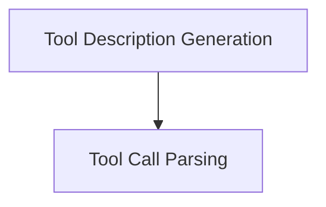

# Tool Message Generation Module

## Introduction

The `tool_message_generation` module is a crucial component within the `partners_anthropic_experimental` package, designed to facilitate seamless interaction between Anthropic's language models and external tools. It handles two primary functions: generating clear, structured descriptions of available tools for the AI to understand and utilize, and parsing the AI's XML-formatted responses into actionable tool calls.

This module enhances the capability of Anthropic models to perform complex tasks by enabling them to effectively leverage external functionalities, thereby extending their utility beyond basic text generation.

## Architecture

The `tool_message_generation` module is composed of two main sub-modules:

<!-- DIAGRAM_JSON
{
    "direction": "TD",
    "nodes": [
        {"id": "tool_description_generation", "label": "Tool Description Generation", "type": "module", "link": "tool_description_generation.md"},
        {"id": "tool_call_parsing", "label": "Tool Call Parsing", "type": "module", "link": "tool_call_parsing.md"}
    ],
    "edges": [
        {"source": "tool_description_generation", "target": "tool_call_parsing"}
    ],
    "groups": []
}
-->

## Sub-modules

### [Tool Description Generation](tool_description_generation.md)
This sub-module is responsible for transforming a list of tool definitions into a formatted system message. This message provides the Anthropic model with a clear, structured description of the tools it has access to, including their names, descriptions, and parameters. This enables the AI to understand how to properly invoke these tools.

### [Tool Call Parsing](tool_call_parsing.md)
This sub-module handles the interpretation of the AI's responses when it decides to use a tool. Specifically, it parses XML elements from the AI's output and converts them into a list of structured tool calls, which can then be executed by the system. This allows for the dynamic invocation of tools based on the AI's reasoning.
