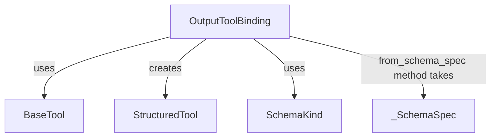

# Module: `tool_output_binding`

## Introduction
The `tool_output_binding` module, specifically the `OutputToolBinding` class, is a crucial component within the `langchain_v1_agents_structured_output` package. Its primary purpose is to manage the metadata and functionality required for processing structured outputs generated by agents in response to tool calls. This module facilitates the binding of various schema types (Pydantic models, dataclasses, TypedDicts, or JSON schema dictionaries) to LangChain `BaseTool` instances, enabling robust parsing and validation of tool arguments.

## Architecture and Component Relationships

The `OutputToolBinding` class acts as an intermediary, encapsulating the original schema, its classification, and the corresponding LangChain `BaseTool` instance. It leverages external modules for core tool definitions and potentially for schema classification.

<!-- DIAGRAM_JSON
{
    "direction": "TD",
    "nodes": [
        {"id": "output_tool_binding", "label": "OutputToolBinding", "type": "component", "link": null},
        {"id": "base_tool", "label": "BaseTool", "type": "external", "link": "core_tools.md"},
        {"id": "structured_tool", "label": "StructuredTool", "type": "external", "link": "core_tools.md"},
        {"id": "schema_kind", "label": "SchemaKind", "type": "external", "link": "provider_output_binding.md"},
        {"id": "schema_spec", "label": "_SchemaSpec", "type": "external", "link": "provider_output_binding.md"}
    ],
    "edges": [
        {"source": "output_tool_binding", "target": "base_tool", "label": "uses"},
        {"source": "output_tool_binding", "target": "structured_tool", "label": "creates"},
        {"source": "output_tool_binding", "target": "schema_kind", "label": "uses"},
        {"source": "output_tool_binding", "target": "schema_spec", "label": "from_schema_spec method takes"}
    ],
    "groups": []
}
-->

## Core Functionality

### `OutputToolBinding` Class

`OutputToolBinding(Generic[SchemaT])`

This class provides the structure to hold information about a structured output tool.

**Purpose:**
To encapsulate the schema, its type, and the corresponding LangChain tool instance used for handling structured responses from tool calls.

**Attributes:**

*   `schema: type[SchemaT] | dict[str, Any]`
    *   The original schema provided for structured output. This can be a Pydantic model, a dataclass, a TypedDict, or a raw JSON schema dictionary.
*   `schema_kind: SchemaKind`
    *   An enumeration that classifies the type of the schema (e.g., Pydantic, dataclass, TypedDict). This classification guides the proper construction of responses.
*   `tool: BaseTool`
    *   The actual LangChain `BaseTool` instance created from the schema, which is used for model binding and interaction.

**Methods:**

*   `classmethod from_schema_spec(cls, schema_spec: _SchemaSpec[SchemaT]) -> Self`
    *   **Purpose:** Factory method to create an `OutputToolBinding` instance from a `_SchemaSpec` object. This method abstracts the creation of the underlying `StructuredTool`.
    *   **Parameters:**
        *   `schema_spec`: An instance of `_SchemaSpec` containing the schema, its kind, name, and description.
    *   **Returns:** An `OutputToolBinding` instance, with a `StructuredTool` created based on the provided schema specification.
*   `parse(self, tool_args: dict[str, Any]) -> SchemaT`
    *   **Purpose:** Parses the arguments received from a tool call according to the defined schema.
    *   **Parameters:**
        *   `tool_args`: A dictionary containing the arguments generated by the tool call.
    *   **Returns:** The parsed response, validated and structured according to `OutputToolBinding`'s `schema`.
    *   **Raises:** `ValueError` if the parsing process encounters any issues.

## How it Fits into the Overall System

The `tool_output_binding` module is integral to the agent's ability to handle and validate structured outputs. When an agent needs to produce a response that adheres to a specific structure (e.g., a JSON object with predefined fields), `OutputToolBinding` ensures that this structure is correctly defined, associated with a LangChain tool, and that the agent's output is properly parsed and validated against it. This mechanism enhances the reliability and predictability of agent interactions when structured data is required. It works in conjunction with modules like [provider_output_binding](provider_output_binding.md) which likely define or manage the `_SchemaSpec` and `SchemaKind` entities, and [core_tools](core_tools.md) for the fundamental tool definitions.
