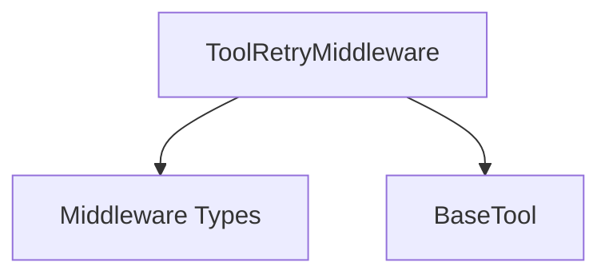

# `tool_retry` Module Documentation

## Introduction
The `tool_retry` module provides a robust middleware (`ToolRetryMiddleware`) for automatically retrying failed tool calls within an agent's execution flow. This module enhances the resilience of agents by handling transient errors through configurable retry attempts, exponential backoff, and selective exception handling.

## Purpose and Core Functionality
The primary purpose of the `tool_retry` module is to introduce fault tolerance into agent tool interactions. It intercepts tool call requests and, in the event of an exception, retries the call based on predefined rules. This prevents agent failures due to temporary issues like network glitches, API rate limits, or transient service unavailability.

Key functionalities include:
-   **Configurable Retries:** Define the maximum number of retry attempts.
-   **Selective Retries:** Specify which exceptions should trigger a retry, or provide a custom function for granular control.
-   **Exponential Backoff:** Implement a waiting strategy between retries to prevent overwhelming external services, with options for constant delay and jitter.
-   **Tool Filtering:** Apply retry logic to all tools or a specific subset of tools.
-   **Custom Failure Handling:** Configure behavior upon exhaustion of retries, such as returning an error message to the LLM or re-raising the original exception.

## Architecture and Component Relationships

<!-- DIAGRAM_JSON
{
    "direction": "TD",
    "nodes": [
        {"id": "tool_retry_middleware", "label": "ToolRetryMiddleware", "type": "component", "link": null},
        {"id": "middleware_types", "label": "Middleware Types", "type": "external", "link": "middleware_types.md"},
        {"id": "base_tool", "label": "BaseTool", "type": "external", "link": "core_tools.md"}
    ],
    "edges": [
        {"source": "tool_retry_middleware", "target": "middleware_types"},
        {"source": "tool_retry_middleware", "target": "base_tool"}
    ],
    "groups": []
}
-->

### `ToolRetryMiddleware`
The `ToolRetryMiddleware` class is the central component of this module. It implements the `AgentMiddleware` interface, allowing it to intercept and wrap tool call requests. It manages the retry logic, including:
-   Initialization with retry parameters (max retries, backoff, delays, jitter).
-   Filtering tool calls to apply retry logic only to specified tools.
-   Catching exceptions during tool execution.
-   Deciding whether an exception should trigger a retry based on configured `retry_on` criteria.
-   Calculating and applying delays between retry attempts.
-   Handling the final outcome when retries are exhausted (either by informing the LLM or raising the exception).
-   Providing both synchronous (`wrap_tool_call`) and asynchronous (`awrap_tool_call`) mechanisms for tool interception.

### External Dependencies

-   [`Middleware Types`](middleware_types.md): The `ToolRetryMiddleware` inherits from `AgentMiddleware` and utilizes various types defined in the `middleware_types` module, such as `AgentState`, `ToolCallRequest`, `ToolMessage`, and `Command`, to integrate seamlessly into the agent middleware ecosystem.
-   [`BaseTool`](core_tools.md): This module interacts with `BaseTool` instances when filtering which tools to apply retry logic to, or when extracting tool names from `ToolCallRequest` objects. While `core_tools` is a broader module, `BaseTool` is the specific relevant entity.

## How the Module Fits into the Overall System
The `tool_retry` module is a critical part of the agent middleware system, located within `langchain_v1_agents_middleware`. Its position as middleware allows it to transparently inject retry logic into any agent that utilizes the middleware pipeline, without requiring modifications to the core agent or tool implementations.

By providing configurable retry mechanisms, `tool_retry` significantly improves the reliability and robustness of agents, especially in environments where external tool dependencies may be prone to transient failures. It allows agents to gracefully recover from temporary issues, leading to more stable and performant AI applications. It acts as a defensive layer, preventing minor interruptions from cascading into complete agent failures, and thereby contributes to a more resilient overall system.
