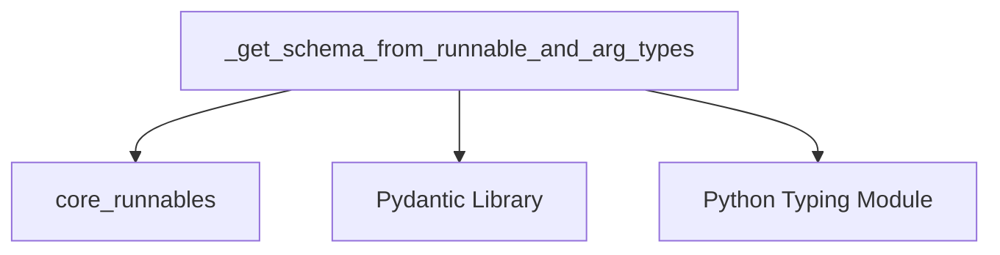

# Module: `tool_schema_management`

## Introduction
The `tool_schema_management` module is a vital component within the system, primarily responsible for dynamically generating and managing input schemas for tools. It facilitates the conversion of runnable components and their argument types into structured Pydantic models, which are essential for defining and validating tool inputs. This ensures that tools receive correctly formatted data, enhancing reliability and interoperability across the system.

## Core Functionality

### Schema Generation from Runnables (`_get_schema_from_runnable_and_arg_types`)
The primary function of this module is `_get_schema_from_runnable_and_arg_types`. This utility infers the input schema required by a `Runnable` instance, converting it into a Pydantic `BaseModel`. This process involves:
1.  **Type Hint Extraction**: Attempting to extract type hints from the `Runnable`'s `InputType`. This leverages Python's `typing` module for introspection.
2.  **Pydantic Model Creation**: Utilizing the extracted type hints to dynamically create a Pydantic `BaseModel` using `create_model`. Each type hint becomes a field in the generated schema.
3.  **Error Handling**: If the `InputType` is not sufficiently typed (e.g., a generic `dict` without explicit argument types), a `TypeError` is raised, guiding developers to either annotate types (e.g., with `TypedDict`) or provide `arg_types` explicitly.

This functionality is crucial for tools that need a clear, machine-readable definition of their expected inputs, enabling robust validation and integration with other system components like agents that utilize tools.

## Architecture and Component Relationships

The `tool_schema_management` module, particularly its core function, interacts with several key external components:

*   **`core_runnables`**: Provides the `Runnable` abstraction, which is the base type for components whose schemas are being generated. This module depends on the definition and structure of `Runnable` objects.
*   **Pydantic Library**: Heavily relies on Pydantic for schema definition and validation. Specifically, it uses `BaseModel` for the generated schemas, `create_model` for dynamic schema construction, and `Field` for defining individual schema properties.
*   **Python's `typing` Module**: Utilizes `get_type_hints` for runtime introspection of type annotations, which is fundamental to inferring the structure of tool inputs.

<!-- DIAGRAM_JSON
{
    "direction": "TD",
    "nodes": [
        {"id": "get_schema", "label": "_get_schema_from_runnable_and_arg_types", "type": "component", "link": null},
        {"id": "core_runnables", "label": "core_runnables", "type": "external", "link": "core_runnables.md"},
        {"id": "pydantic", "label": "Pydantic Library", "type": "external", "link": null},
        {"id": "typing", "label": "Python Typing Module", "type": "external", "link": null}
    ],
    "edges": [
        {"source": "get_schema", "target": "core_runnables"},
        {"source": "get_schema", "target": "pydantic"},
        {"source": "get_schema", "target": "typing"}
    ],
    "groups": []
}
-->

## How the Module Fits into the Overall System
The `tool_schema_management` module plays a critical role in the broader system by providing a standardized mechanism for tools to declare their input requirements. This is particularly important for:

*   **Agent-Tool Interaction**: Agents (e.g., from `classic_agents` or `core_agents`) that need to call tools rely on these schemas to understand what arguments to provide and in what format.
*   **System Validation**: By generating Pydantic schemas, the module enables automatic validation of tool inputs, catching errors early and ensuring data integrity.
*   **Tool Development**: Simplifies tool development by allowing developers to define tool inputs using standard Python type hints, which are then automatically converted into a formal schema.
*   **API Generation**: The generated schemas can be used to automatically generate API documentation or client code for tools, improving discoverability and ease of use.

In essence, this module acts as a bridge between the dynamic, runnable components of the system and the structured, validated input requirements of tools, ensuring seamless and robust communication.
