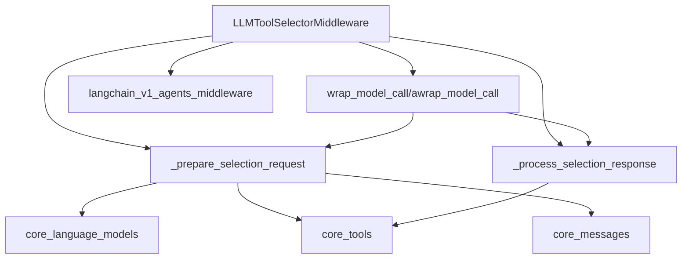

# Tool Selection Module

The `tool_selection` module provides a crucial middleware component, `LLMToolSelectorMiddleware`, designed to enhance the efficiency and focus of agent-based systems. This middleware intelligently filters the available tools for an agent by leveraging a separate Language Model (LLM) to select only the most relevant tools for a given user query. This process significantly reduces token usage and helps the main agent model concentrate on pertinent tools, leading to more accurate and cost-effective operations.

## Architecture and Component Relationships

The `LLMToolSelectorMiddleware` acts as an intermediary, intercepting model calls to perform tool selection before the primary agent model is invoked. It integrates with core components related to language models, tools, and messaging to facilitate its operation.

<!-- DIAGRAM_JSON
{
    "direction": "TD",
    "nodes": [
        {"id": "llm_tool_selector_middleware", "label": "LLMToolSelectorMiddleware", "type": "component", "link": null},
        {"id": "prepare_selection_request", "label": "_prepare_selection_request", "type": "component", "link": null},
        {"id": "process_selection_response", "label": "_process_selection_response", "type": "component", "link": null},
        {"id": "wrap_model_call_methods", "label": "wrap_model_call/awrap_model_call", "type": "component", "link": null},
        {"id": "core_language_models", "label": "core_language_models", "type": "external", "link": "core_language_models.md"},
        {"id": "core_tools", "label": "core_tools", "type": "external", "link": "core_tools.md"},
        {"id": "core_messages", "label": "core_messages", "type": "external", "link": "core_messages.md"},
        {"id": "langchain_v1_agents_middleware", "label": "langchain_v1_agents_middleware", "type": "external", "link": "langchain_v1_agents_middleware.md"}
    ],
    "edges": [
        {"source": "llm_tool_selector_middleware", "target": "langchain_v1_agents_middleware"},
        {"source": "llm_tool_selector_middleware", "target": "prepare_selection_request"},
        {"source": "llm_tool_selector_middleware", "target": "process_selection_response"},
        {"source": "llm_tool_selector_middleware", "target": "wrap_model_call_methods"},
        {"source": "wrap_model_call_methods", "target": "prepare_selection_request"},
        {"source": "wrap_model_call_methods", "target": "process_selection_response"},
        {"source": "prepare_selection_request", "target": "core_language_models"},
        {"source": "prepare_selection_request", "target": "core_tools"},
        {"source": "prepare_selection_request", "target": "core_messages"},
        {"source": "process_selection_response", "target": "core_tools"}
    ],
    "groups": []
}
-->

### `LLMToolSelectorMiddleware`

This is the primary class within the `tool_selection` module. It inherits from `AgentMiddleware` ([`langchain_v1_agents_middleware.md`](langchain_v1_agents_middleware.md)) and is responsible for pre-filtering tools before an agent's main model call.

**Core Functionality:**

*   **Initialization (`__init__`)**: Configures the middleware with an optional selection model (can default to the agent's main model), a system prompt for the selection LLM, a maximum number of tools to select (`max_tools`), and a list of tool names to `always_include` regardless of the selection process.
*   **Request Preparation (`_prepare_selection_request`)**: This internal method processes the incoming `ModelRequest` to extract necessary information for tool selection. It filters tools, validates `always_include` tools against available tools, constructs a tailored system message for the selection LLM (incorporating `max_tools` limits if specified), and identifies the last user message ([`core_messages.md`](core_messages.md)) for the selection query. It interacts with `BaseTool` instances ([`core_tools.md`](core_tools.md)).
*   **Response Processing (`_process_selection_response`)**: After the selection LLM provides a response, this internal method parses the selected tool names. It handles potential invalid selections, enforces the `max_tools` limit, and ensures that `always_include` tools are added to the final list. The original `ModelRequest` is then overridden with the filtered set of tools.
*   **Model Call Wrapping (`wrap_model_call`, `awrap_model_call`)**: These methods (`wrap_model_call` for synchronous and `awrap_model_call` for asynchronous operations) are the entry points for the middleware. They orchestrate the tool selection process:
    1.  Call `_prepare_selection_request` to get inputs for the selection model.
    2.  Invoke the configured selection LLM (which can be a `BaseChatModel` from [`core_language_models.md`](core_language_models.md)) with a structured output schema to get the selected tool names.
    3.  Call `_process_selection_response` to refine the tool list.
    4.  Finally, pass the modified `ModelRequest` (with the filtered tools) to the original handler for the main agent model's execution.

## How it Fits into the Overall System

The `tool_selection` module, specifically the `LLMToolSelectorMiddleware`, is an integral part of the `langchain_v1_agents_middleware` system ([`langchain_v1_agents_middleware.md`](langchain_v1_agents_middleware.md)). It acts as a pre-processing layer for agents that utilize a large number of tools. By intelligently narrowing down the tool options, it helps to:

*   **Reduce Token Usage**: Fewer tools presented to the main agent model mean less context and therefore lower token consumption during generation.
*   **Improve Agent Focus**: The main agent model can focus its reasoning on a smaller, more relevant set of tools, potentially leading to more accurate and faster decision-making.
*   **Enhance Performance**: By optimizing tool selection, the overall performance and reliability of complex agent systems are improved, especially in scenarios with extensive toolkits.

This middleware exemplifies a common pattern in advanced agent design: using auxiliary LLMs or models to manage and refine inputs for the primary task-executing LLM, thereby improving both efficiency and effectiveness.