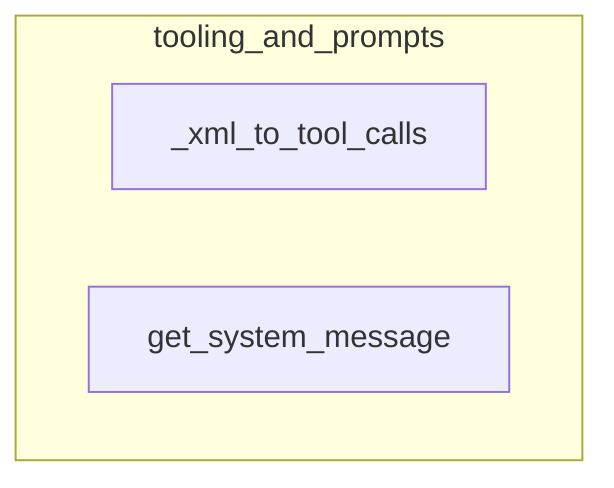

# tooling_and_prompts
This module provides utilities for handling tool definitions, including converting XML representations of tool calls into structured data and generating descriptive system messages for available tools.

<!-- DIAGRAM_JSON
{
  "nodes": [
    {"id": "_xml_to_tool_calls", "label": "_xml_to_tool_calls"},
    {"id": "get_system_message", "label": "get_system_message"}
  ],
  "edges": [],
  "groups": [
    {"id": "tooling_and_prompts", "label": "tooling_and_prompts", "nodes": ["_xml_to_tool_calls", "get_system_message"]}
  ]
}
-->
