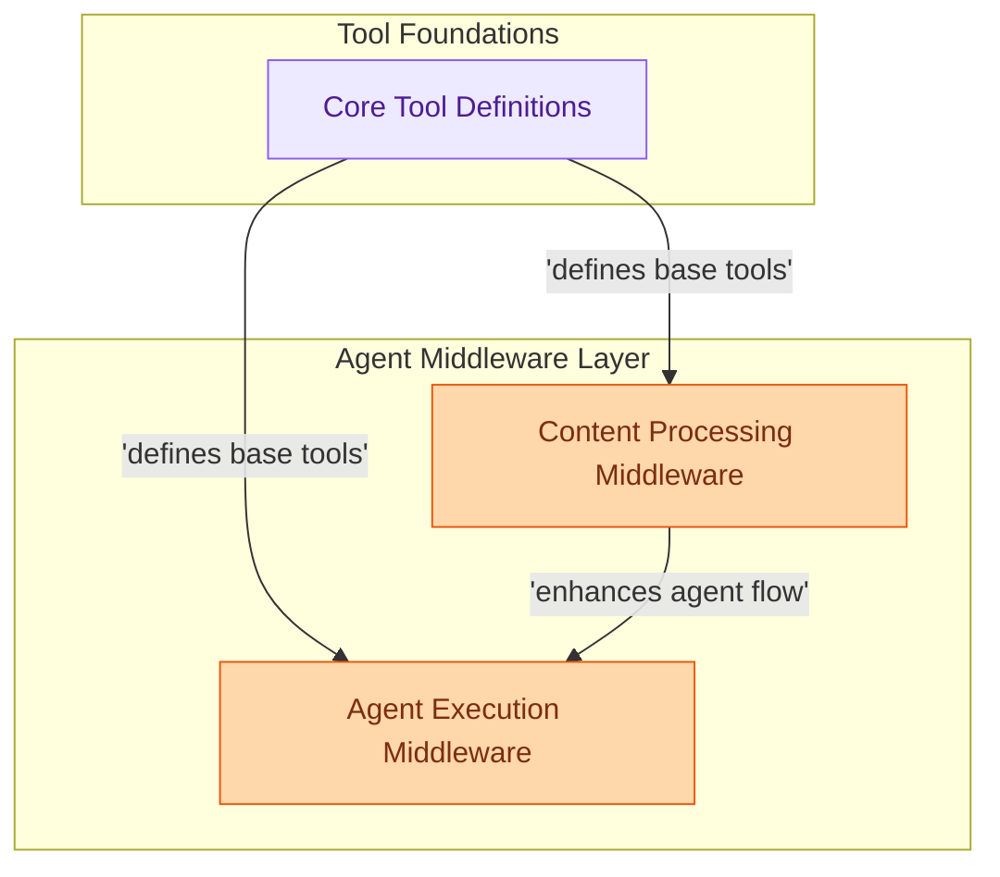

# Tools and Middleware Overview
This module provides core tool definitions and a comprehensive suite of middleware for agent execution, including content processing, PII detection, summarization, and robust error handling.

<!-- DIAGRAM_JSON
{
    "direction": "TD",
    "nodes": [
        {"id": "core_tool_definitions", "label": "Core Tool Definitions", "type": "module", "link": "core_tool_definitions.md"},
        {"id": "agent_execution_middleware", "label": "Agent Execution Middleware", "type": "module", "link": "agent_execution_middleware.md"},
        {"id": "content_processing_middleware", "label": "Content Processing Middleware", "type": "module", "link": "content_processing_middleware.md"}
    ],
    "edges": [
        {"source": "core_tool_definitions", "target": "agent_execution_middleware", "label": "defines base tools"},
        {"source": "core_tool_definitions", "target": "content_processing_middleware", "label": "defines base tools"},
        {"source": "content_processing_middleware", "target": "agent_execution_middleware", "label": "enhances agent flow"}
    ],
    "groups": [
        {"id": "tool_foundations", "label": "Tool Foundations", "role": "analytical", "nodes": ["core_tool_definitions"]},
        {"id": "agent_middleware_layer", "label": "Agent Middleware Layer", "role": "generative", "nodes": ["agent_execution_middleware", "content_processing_middleware"]}
    ]
}
-->

