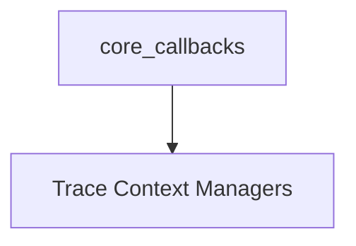

# Trace Group Management Module

## Introduction and Purpose

The `trace_group_management` module provides utilities for grouping related chain executions into a single trace run within LangSmith. This is crucial for simplifying complex trace visualizations and improving the debugging experience by logically organizing operations that might span multiple individual chain or LLM calls. It offers both synchronous and asynchronous context managers to facilitate this grouping.

## Architecture Overview

The `trace_group_management` module is a sub-module of `core_callbacks.trace_managers`. It primarily relies on the core callback managers provided by `langchain_core` to orchestrate the start, end, and error handling of grouped traces. It integrates with LangSmith tracing functionality to enable comprehensive observability of grouped operations.

<!-- DIAGRAM_JSON
{
    "direction": "TD",
    "nodes": [
        {"id": "trace_context_managers", "label": "Trace Context Managers", "type": "module", "link": "trace_context_managers.md"},
        {"id": "core_callbacks", "label": "core_callbacks", "type": "external", "link": "core_callbacks.md"}
    ],
    "edges": [
        {"source": "core_callbacks", "target": "trace_context_managers"}
    ],
    "groups": []
}
-->

## Sub-modules

### [Trace Context Managers](trace_context_managers.md)

This sub-module contains the core context managers, `trace_as_chain_group` and `atrace_as_chain_group`, which allow developers to define a logical group for various chain and LLM invocations. These managers automatically handle the lifecycle of a grouped trace, including its start, end, and any errors that occur within the group, providing a unified view in LangSmith.