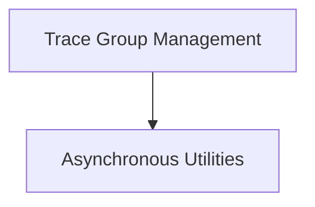

# Trace Managers Module

## Introduction

The `trace_managers` module provides core functionalities for managing and grouping traces within the LangChain framework, particularly for callback management and asynchronous operations. It enables developers to group related calls into single logical runs, facilitating better observability and control over execution flows in complex applications.

## Architecture

The `trace_managers` module is structured into two main sub-modules:

*   **Trace Group Management**: Handles the creation and management of synchronous and asynchronous chain groups for tracing.
*   **Asynchronous Utilities**: Provides utility functions for managing asynchronous contexts, ensuring proper context propagation.

<!-- DIAGRAM_JSON
{
    "direction": "TD",
    "nodes": [
        {"id": "trace_group_management", "label": "Trace Group Management", "type": "module", "link": "trace_group_management.md"},
        {"id": "async_utilities", "label": "Asynchronous Utilities", "type": "module", "link": "async_utilities.md"}
    ],
    "edges": [
        {"source": "trace_group_management", "target": "async_utilities"}
    ],
    "groups": []
}
-->

## Sub-modules

### [Trace Group Management](trace_group_management.md)

This sub-module focuses on providing context managers for grouping different calls together as a single run. This is crucial for tracing and callback management, especially when dealing with complex chains or multiple independent calls that logically belong to a single operation.

### [Asynchronous Utilities](async_utilities.md)

This sub-module contains utility functions specifically designed to handle asynchronous operations. It ensures that context variables are properly preserved across asynchronous tasks, which is vital for maintaining consistent state and tracing information in an async environment.
