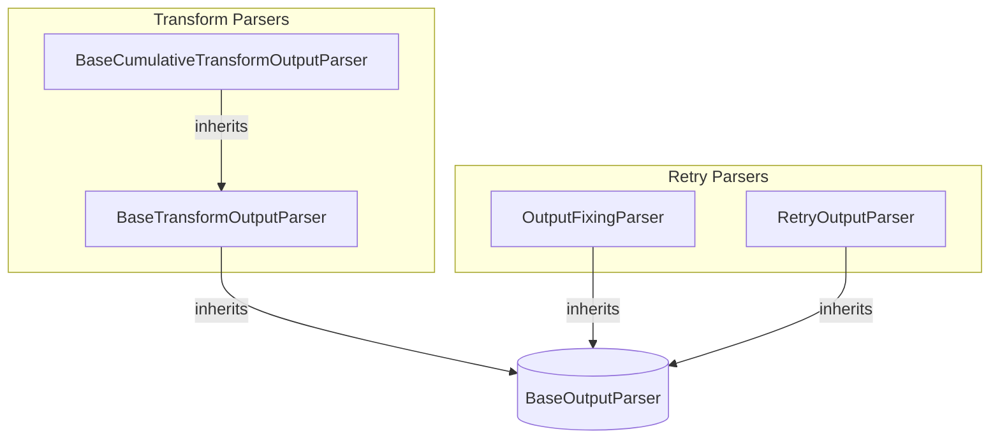

# transform_and_retry_parsers
This module provides output parsers for transforming streaming input and for retrying parsing attempts. It includes base classes for cumulative and standard transformations, as well as parsers for fixing and retrying output parsing errors.

<!-- DIAGRAM_JSON
{
    "nodes": [
        {
            "id": "BCUM",
            "label": "BaseCumulativeTransformOutputParser",
            "type": "class"
        },
        {
            "id": "BTRANS",
            "label": "BaseTransformOutputParser",
            "type": "class"
        },
        {
            "id": "OFIX",
            "label": "OutputFixingParser",
            "type": "class"
        },
        {
            "id": "RETRY",
            "label": "RetryOutputParser",
            "type": "class"
        },
        {
            "id": "BOP",
            "label": "BaseOutputParser",
            "type": "interface"
        }
    ],
    "edges": [
        {
            "source": "BCUM",
            "target": "BTRANS",
            "type": "inheritance"
        },
        {
            "source": "BTRANS",
            "target": "BOP",
            "type": "inheritance"
        },
        {
            "source": "OFIX",
            "target": "BOP",
            "type": "inheritance"
        },
        {
            "source": "RETRY",
            "target": "BOP",
            "type": "inheritance"
        },
        {
            "source": "OFIX",
            "target": "BOP",
            "type": "composition",
            "label": "parser"
        },
        {
            "source": "RETRY",
            "target": "BOP",
            "type": "composition",
            "label": "parser"
        }
    ],
    "groups": [
        {
            "id": "transform_parsers",
            "label": "Transform Parsers",
            "nodes": [
                "BCUM",
                "BTRANS"
            ]
        },
        {
            "id": "retry_parsers",
            "label": "Retry Parsers",
            "nodes": [
                "OFIX",
                "RETRY"
            ]
        }
    ]
}
-->
