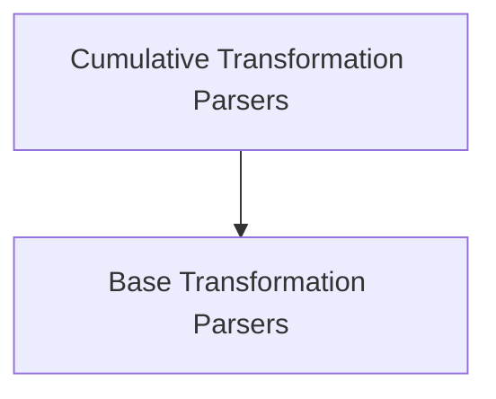

# Transform Parsers Module

## Introduction

The `transform_parsers` module provides a flexible framework for parsing streamed outputs, essential for applications requiring real-time processing of language model responses. It defines base classes for handling both simple streaming transformations and more advanced cumulative parsing, including the ability to generate diffs between successive parsed states.

## Architecture

The `transform_parsers` module is structured around two core parser types: `BaseTransformOutputParser` and `BaseCumulativeTransformOutputParser`. These parsers extend the `BaseOutputParser` and are designed to efficiently process input streams, converting raw text or message chunks into structured output.

<!-- DIAGRAM_JSON
{
    "direction": "TD",
    "nodes": [
        {"id": "base_transformation_parsers", "label": "Base Transformation Parsers", "type": "module", "link": "base_transformation_parsers.md"},
        {"id": "cumulative_transformation_parsers", "label": "Cumulative Transformation Parsers", "type": "module", "link": "cumulative_transformation_parsers.md"}
    ],
    "edges": [
        {"source": "cumulative_transformation_parsers", "target": "base_transformation_parsers"}
    ],
    "groups": []
}
-->

## Sub-modules

### [Base Transformation Parsers](base_transformation_parsers.md)
This sub-module contains the `BaseTransformOutputParser` class, which serves as the fundamental building block for output parsers capable of processing streaming data. It provides methods for both synchronous and asynchronous stream transformation, ensuring compatibility with various execution environments.

### [Cumulative Transformation Parsers](cumulative_transformation_parsers.md)
Building upon the base transform parsers, this sub-module introduces `BaseCumulativeTransformOutputParser`. This advanced parser handles streaming inputs cumulatively, allowing for the generation of incremental diffs or complete parsed outputs. It is particularly useful for scenarios where observing changes in the output over time is crucial.
