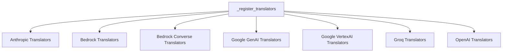

# translator_registration

The `translator_registration` module is responsible for orchestrating the registration of various message block translators within the LangChain Core framework. It ensures that the system can correctly interpret and translate message blocks originating from different AI providers, such as Anthropic, Bedrock, Google Generative AI, Groq, and OpenAI.

## Architecture and Component Relationships

This module's primary function is to call registration routines from individual translator modules, making them available for use throughout the `core_messages` system. This centralized registration mechanism simplifies the process of integrating new message block translation capabilities.

<!-- DIAGRAM_JSON
{
    "direction": "TD",
    "nodes": [
        {"id": "_register_translators", "label": "_register_translators", "type": "component", "link": null},
        {"id": "anthropic_translators", "label": "Anthropic Translators", "type": "external", "link": "anthropic_translators.md"},
        {"id": "bedrock_translators", "label": "Bedrock Translators", "type": "external", "link": "bedrock_translators.md"},
        {"id": "bedrock_converse_translators", "label": "Bedrock Converse Translators", "type": "external", "link": "bedrock_converse_translators.md"},
        {"id": "google_genai_translators", "label": "Google GenAI Translators", "type": "external", "link": "google_genai_translators.md"},
        {"id": "google_vertexai_translators", "label": "Google VertexAI Translators", "type": "external", "link": "google_vertexai_translators.md"},
        {"id": "groq_translators", "label": "Groq Translators", "type": "external", "link": "groq_translators.md"},
        {"id": "openai_translators", "label": "OpenAI Translators", "type": "external", "link": "openai_translators.md"}
    ],
    "edges": [
        {"source": "_register_translators", "target": "anthropic_translators"},
        {"source": "_register_translators", "target": "bedrock_translators"},
        {"source": "_register_translators", "target": "bedrock_converse_translators"},
        {"source": "_register_translators", "target": "google_genai_translators"},
        {"source": "_register_translators", "target": "google_vertexai_translators"},
        {"source": "_register_translators", "target": "groq_translators"},
        {"source": "_register_translators", "target": "openai_translators"}
    ],
    "groups": []
}
-->


## Core Functionality

The `translator_registration` module exposes a single primary function:

### `_register_translators()`

This function is responsible for importing and invoking the registration functions for all supported message block translators within `langchain-core`. This ensures that when the application starts, all necessary translation capabilities are initialized and ready for use.

**Code Snippet:**

```python
def _register_translators() -> None:
    """Register all translators in langchain-core.

    A unit test ensures all modules in `block_translators` are represented here.

    For translators implemented outside langchain-core, they can be registered by
    calling `register_translator` from within the integration package.
    """
    from langchain_core.messages.block_translators.anthropic import (
        _register_anthropic_translator,
    )
    from langchain_core.messages.block_translators.bedrock import (
        _register_bedrock_translator,
    )
    from langchain_core.messages.block_translators.bedrock_converse import (
        _register_bedrock_converse_translator,
    )
    from langchain_core.messages.block_translators.google_genai import (
        _register_google_genai_translator,
    )
    from langchain_core.messages.block_translators.google_vertexai import (
        _register_google_vertexai_translator,
    )
    from langchain_core.messages.block_translators.groq import (
        _register_groq_translator,
    )
    from langchain_core.messages.block_translators.openai import (
        _register_openai_translator,
    )

    _register_bedrock_translator()
    _register_bedrock_converse_translator()
    _register_anthropic_translator()
    _register_google_genai_translator()
    _register_google_vertexai_translator()
    _register_groq_translator()
    _register_openai_translator()
```

## How it Fits into the Overall System

The `translator_registration` module is a fundamental part of the [core_messages](core_messages.md) module, specifically within its `block_translators` sub-package. By centralizing the registration of various message block translators, it enables the `core_messages` module to seamlessly handle message formats from diverse AI providers. This module acts as an initialization point, ensuring that the appropriate translation logic is loaded and available when the application requires it, thereby promoting interoperability and extensibility across different language models and APIs.

Developers extending LangChain Core with new AI provider integrations can register their custom message block translators by calling `register_translator` from within their integration package. This allows new message types and formats to be seamlessly incorporated into the existing message handling infrastructure without modifying the core `translator_registration` module directly.
