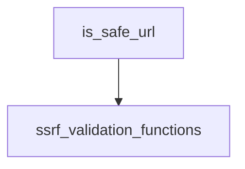

# url_safety_checks

## Introduction

The `url_safety_checks` module provides a crucial utility for validating URLs within the system, primarily focused on preventing Server-Side Request Forgery (SSRF) vulnerabilities. It offers a convenient, non-throwing function, `is_safe_url`, which simplifies URL validation logic by returning a boolean value instead of raising an exception.

## Module Purpose and Core Functionality

This module's primary purpose is to offer a straightforward way to determine if a given URL is "safe" for consumption by the application. "Safe" in this context generally means the URL does not point to private network resources (unless explicitly allowed) and uses an allowed protocol (HTTP/HTTPS). The `is_safe_url` function encapsulates more rigorous validation logic provided by the `ssrf_validation_functions` module, making it easier for other parts of the system to integrate URL safety checks without complex error handling.

### `is_safe_url`

```python
def is_safe_url(
    url: str | AnyHttpUrl,
    *,
    allow_private: bool = False,
    allow_http: bool = True,
) -> bool:
    """Check if a URL is safe (non-throwing version of validate_safe_url).

    Args:
        url: The URL to check
        allow_private: If True, allows private IPs and localhost
        allow_http: If True, allows both HTTP and HTTPS

    Returns:
        True if URL is safe, False otherwise

    Examples:
        >>> is_safe_url("https://example.com")
        True

        >>> is_safe_url("http://127.0.0.1:8080")
        False

        >>> is_safe_url("http://localhost:8080", allow_private=True)
        True
    """
    try:
        validate_safe_url(url, allow_private=allow_private, allow_http=allow_http)
    except ValueError:
        return False
    else:
        return True
```

This function acts as a wrapper around the more strict `validate_safe_url` function, catching any `ValueError` raised during validation and returning `False`. This design choice allows calling modules to use `is_safe_url` in conditional statements without needing `try-except` blocks, leading to cleaner code.

## Architecture and Component Relationships

The `url_safety_checks` module is a leaf module under `core_security`. Its core component, `is_safe_url`, directly depends on the `validate_safe_url` function, which resides in the [ssrf_validation_functions](ssrf_validation_functions.md) module. This establishes a clear dependency on the more comprehensive SSRF protection mechanisms provided by `core_security`.

<!-- DIAGRAM_JSON
{
    "direction": "TD",
    "nodes": [
        {"id": "is_safe_url", "label": "is_safe_url", "type": "component", "link": null},
        {"id": "ssrf_validation_functions", "label": "ssrf_validation_functions", "type": "external", "link": "ssrf_validation_functions.md"}
    ],
    "edges": [
        {"source": "is_safe_url", "target": "ssrf_validation_functions"}
    ],
    "groups": []
}
-->



## How the Module Fits into the Overall System

The `url_safety_checks` module plays a vital role in the system's overall security posture, particularly concerning external URL interactions. By providing a simple boolean check for URL safety, it enables various components across the application (e.g., agents, tools, or API handlers) to quickly and efficiently vet URLs before making requests or processing them further. This helps to prevent malicious actors from exploiting SSRF vulnerabilities to access internal resources or bypass security controls, thereby contributing to the robustness of the entire system. It acts as a convenient abstraction over more complex SSRF validation logic, promoting easier integration of security best practices.