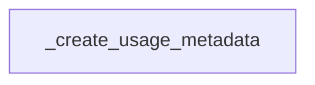

# Module: usage_metadata_generation

## Introduction
The `usage_metadata_generation` module is responsible for processing token usage information from OpenAI API responses and generating structured usage metadata. This module helps in tracking and categorizing token consumption, including details related to service tiers and specific token types like audio, cached, and reasoning tokens.

## Architecture and Component Relationships

The `usage_metadata_generation` module currently contains a single core component: `_create_usage_metadata`. This function takes raw token usage data from OpenAI responses and transforms it into a `UsageMetadata` object, which provides a standardized representation of token consumption for various purposes like billing, monitoring, and analytics.

The module's main component directly interacts with the raw token usage dictionary and constructs detailed metadata, including input, output, and total token counts. It also handles specific service tier adjustments and categorizes tokens into details like audio, cache reads, and reasoning.

<!-- DIAGRAM_JSON
{
    "direction": "TD",
    "nodes": [
        {"id": "create_usage_metadata", "label": "_create_usage_metadata", "type": "component", "link": null}
    ],
    "edges": [],
    "groups": []
}
-->

## Core Functionality

### `_create_usage_metadata(oai_token_usage: dict, service_tier: str | None = None) -> UsageMetadata`

This function is the primary entry point for generating usage metadata. It performs the following key operations:

1.  **Token Count Extraction**: Extracts `prompt_tokens`, `completion_tokens`, and `total_tokens` from the raw `oai_token_usage` dictionary. It defaults to 0 if a token type is not found and calculates `total_tokens` if not explicitly provided.
2.  **Service Tier Handling**: Normalizes the `service_tier` input to either "priority", "flex", or `None`.
3.  **Detailed Token Categorization**:
    *   Identifies `audio_tokens` from both prompt and completion details.
    *   Extracts `cached_tokens` for input and `reasoning_tokens` for output, prefixed with the `service_tier` if applicable.
4.  **Service Tier Adjustments**: If a `service_tier` is present, it adjusts the `input_tokens` and `output_tokens` by subtracting any cached or reasoning tokens to avoid double-counting against service tier specific token counts.
5.  **Metadata Object Creation**: Constructs and returns a `UsageMetadata` object, which encapsulates the calculated `input_tokens`, `output_tokens`, `total_tokens`, and detailed `InputTokenDetails` and `OutputTokenDetails` objects. Only non-None detailed token values are included in the final metadata.

This component plays a crucial role in providing granular insights into API usage, which is essential for accurate cost allocation and performance analysis within the OpenAI integration.
