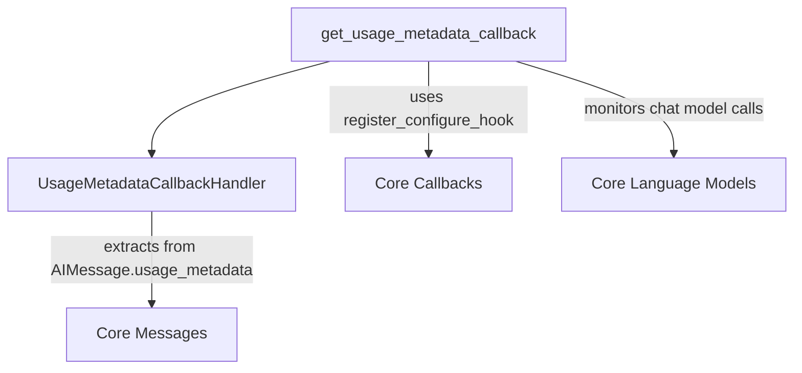

# Usage Tracking Module Documentation

The `usage_tracking` module provides essential utilities for monitoring and aggregating usage metadata from chat model interactions. This module is crucial for gaining insights into the resource consumption of AI applications, particularly in terms of token usage.

## Core Functionality

The primary component of this module is `get_usage_metadata_callback`.

### `get_usage_metadata_callback`

This function acts as a Python context manager, yielding an instance of `UsageMetadataCallbackHandler`. Its main purpose is to track detailed usage metrics, such as input tokens, output tokens, total tokens, and specific token details, across various chat model calls. The collected data is segmented by the model used, providing a granular view of resource consumption.

**Usage Example:**

```python
from langchain.chat_models import init_chat_model
from langchain_core.callbacks import get_usage_metadata_callback

llm_1 = init_chat_model(model="openai:gpt-4o-mini")
llm_2 = init_chat_model(model="anthropic:claude-haiku-4-5-20251001")

with get_usage_metadata_callback() as cb:
    llm_1.invoke("Hello")
    llm_2.invoke("Hello")
    print(cb.usage_metadata)
```

This example demonstrates how to initialize two different language models and, within the context of `get_usage_metadata_callback`, make calls to them. Upon exiting the context, `cb.usage_metadata` will contain a dictionary detailing the token usage for each model.

## Architecture and Component Relationships

The `usage_tracking` module's `get_usage_metadata_callback` function orchestrates the collection of usage metrics. It instantiates and manages a `UsageMetadataCallbackHandler` to store the collected data. The module integrates with the broader callback system, likely through a mechanism like `register_configure_hook` (potentially from the [core_callbacks](core_callbacks.md) module), to ensure proper execution within the application's lifecycle.

It interacts with language models (from [core_language_models](core_language_models.md)) to monitor their calls and extract usage information, which is typically found within `AIMessage.usage_metadata` (part of the [core_messages](core_messages.md) module).

<!-- DIAGRAM_JSON
{
    "direction": "TD",
    "nodes": [
        {"id": "get_usage_metadata_callback", "label": "get_usage_metadata_callback", "type": "component", "link": null},
        {"id": "usage_metadata_callback_handler", "label": "UsageMetadataCallbackHandler", "type": "component", "link": null},
        {"id": "core_callbacks", "label": "Core Callbacks", "type": "external", "link": "core_callbacks.md"},
        {"id": "core_language_models", "label": "Core Language Models", "type": "external", "link": "core_language_models.md"},
        {"id": "core_messages", "label": "Core Messages", "type": "external", "link": "core_messages.md"}
    ],
    "edges": [
        {"source": "get_usage_metadata_callback", "target": "usage_metadata_callback_handler"},
        {"source": "get_usage_metadata_callback", "target": "core_callbacks", "label": "uses register_configure_hook"},
        {"source": "get_usage_metadata_callback", "target": "core_language_models", "label": "monitors chat model calls"},
        {"source": "usage_metadata_callback_handler", "target": "core_messages", "label": "extracts from AIMessage.usage_metadata"}
    ],
    "groups": []
}
-->
