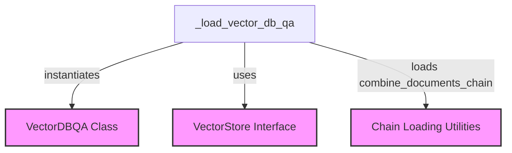

# `vector_db_qa_loader` Module Documentation

The `vector_db_qa_loader` module is a crucial component within the `langchain_classic` ecosystem, specifically designed for loading `VectorDBQA` chains. These chains facilitate question-answering over vector databases by combining a vector store with a document processing chain. This module provides the necessary logic to instantiate such chains, ensuring proper configuration and integration of underlying components.

### Architecture and Component Relationships

The `vector_db_qa_loader` module, primarily through its `_load_vector_db_qa` function, acts as an orchestrator for assembling `VectorDBQA` instances. It relies on external modules for its core functionalities:

1.  **Vector Store Integration**: It takes an existing `vectorstore` instance as input, which is essential for retrieving relevant documents based on a query. This `vectorstore` typically comes from the `core_vectorstores` module or similar implementations.
2.  **Document Combination Chain Loading**: It dynamically loads a `combine_documents_chain`, which is responsible for processing and combining the documents retrieved from the vector store into a coherent response. This chain can be loaded either directly from a configuration dictionary or from a specified path, utilizing general chain loading utilities found in the broader `classic_chains_loading` module.
3.  **VectorDBQA Instantiation**: Once the `vectorstore` and `combine_documents_chain` are ready, the module instantiates the `VectorDBQA` object, likely provided by the `classic_chains_qa_with_sources` module, passing in the prepared components.

This modular design ensures that the `vector_db_qa_loader` remains focused on its primary task of loading the QA chain, while delegating the complexities of vector store management and document chain creation to other specialized modules.

<!-- DIAGRAM_JSON
{
    "direction": "TD",
    "nodes": [
        {"id": "load_vector_db_qa", "label": "_load_vector_db_qa", "type": "component", "link": null},
        {"id": "vector_db_qa_class", "label": "VectorDBQA Class", "type": "external", "link": "classic_chains_qa_with_sources.md"},
        {"id": "vectorstore_interface", "label": "VectorStore Interface", "type": "external", "link": "core_vectorstores.md"},
        {"id": "chain_loading_utils", "label": "Chain Loading Utilities", "type": "external", "link": "classic_chains_loading.md"}
    ],
    "edges": [
        {"source": "load_vector_db_qa", "target": "vector_db_qa_class", "label": "instantiates"},
        {"source": "load_vector_db_qa", "target": "vectorstore_interface", "label": "uses"},
        {"source": "load_vector_db_qa", "target": "chain_loading_utils", "label": "loads combine_documents_chain"}
    ],
    "groups": []
}
-->

### Core Functionality

The primary function of this module is `_load_vector_db_qa`, which is responsible for constructing and returning a `VectorDBQA` instance based on a provided configuration.

#### `_load_vector_db_qa(config: dict, **kwargs: Any) -> VectorDBQA`

This function serves as the entry point for loading a `VectorDBQA` chain.

**Parameters**:

*   **`config`** (`dict`): A dictionary containing configuration parameters for the `VectorDBQA` chain. It expects either `combine_documents_chain` (a dictionary representing the configuration for the document combination chain) or `combine_documents_chain_path` (a string path to load the document combination chain from).
*   **`**kwargs`** (`Any`): Arbitrary keyword arguments, which *must* include a `vectorstore` instance. This `vectorstore` is the backbone for document retrieval in the QA process.

**Functionality**:

1.  **Vector Store Retrieval**: It first attempts to retrieve the `vectorstore` from `kwargs`. If `vectorstore` is not provided, a `ValueError` is raised, as it's a mandatory component.
2.  **Combine Documents Chain Loading**: It then checks the `config` for the `combine_documents_chain`.
    *   If `combine_documents_chain` is present as a dictionary, it uses `load_chain_from_config` (from `classic_chains_loading`) to load the chain.
    *   If `combine_documents_chain_path` is present, it uses `load_chain` (from `classic_chains_loading`) to load the chain from the specified path.
    *   If neither is provided, a `ValueError` is raised, as a document combination chain is crucial for processing retrieved documents.
3.  **VectorDBQA Instantiation**: Finally, it instantiates and returns a `VectorDBQA` object, passing in the loaded `combine_documents_chain`, the `vectorstore`, and any remaining configuration parameters from the `config` dictionary.

### Integration with the Overall System

The `vector_db_qa_loader` module is a specialized loader nestled within the `classic_chains_loading.qa_chains_loading.standard_qa_loaders` hierarchy. Its role is to provide a standardized and configurable mechanism for integrating vector databases into question-answering workflows. By abstracting the loading process, it allows developers to easily set up QA systems that leverage vector similarity for document retrieval, without needing to manually handle the intricate details of chain construction and component dependencies. This module is a key enabler for building robust and scalable RAG (Retrieval-Augmented Generation) applications within the Langchain framework.

*   **Parent Module**: [classic_chains_loading](classic_chains_loading.md)
*   **Related QA Chains**: [classic_chains_qa_with_sources](classic_chains_qa_with_sources.md)
*   **Vector Store Dependency**: [core_vectorstores](core_vectorstores.md)