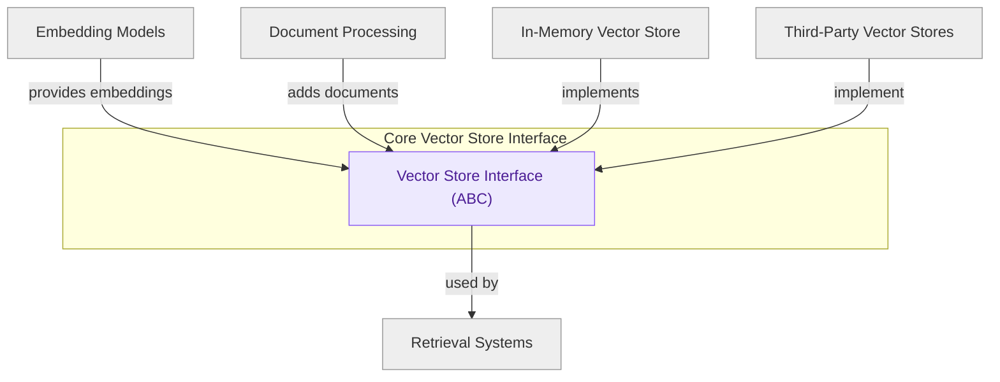

# Vector Store Interface

This module defines the abstract `VectorStore` class, providing a foundational API for vector databases to manage, store, and retrieve vector embeddings and associated documents. It specifies core methods for adding, deleting, and searching documents based on similarity.

<!-- DIAGRAM_JSON
{
    "direction": "TD",
    "nodes": [
        {
            "id": "vector_store_interface",
            "label": "Vector Store Interface (ABC)",
            "type": "component",
            "link": null
        },
        {
            "id": "embedding_models",
            "label": "Embedding Models",
            "type": "external",
            "link": "models_and_embeddings.md"
        },
        {
            "id": "document_processing",
            "label": "Document Processing",
            "type": "external",
            "link": "document_management.md"
        },
        {
            "id": "retrievers",
            "label": "Retrieval Systems",
            "type": "external",
            "link": "retrieval_systems.md"
        },
        {
            "id": "in_memory_vector_store",
            "label": "In-Memory Vector Store",
            "type": "external",
            "link": "in_memory_store.md"
        },
        {
            "id": "third_party_vector_stores",
            "label": "Third-Party Vector Stores",
            "type": "external",
            "link": "partner_integrations.md"
        }
    ],
    "edges": [
        {
            "source": "embedding_models",
            "target": "vector_store_interface",
            "label": "provides embeddings"
        },
        {
            "source": "document_processing",
            "target": "vector_store_interface",
            "label": "adds documents"
        },
        {
            "source": "vector_store_interface",
            "target": "retrievers",
            "label": "used by"
        },
        {
            "source": "in_memory_vector_store",
            "target": "vector_store_interface",
            "label": "implements"
        },
        {
            "source": "third_party_vector_stores",
            "target": "vector_store_interface",
            "label": "implement"
        }
    ],
    "groups": [
        {
            "id": "vector_store_core",
            "label": "Core Vector Store Interface",
            "role": "analytical",
            "nodes": [
                "vector_store_interface"
            ]
        }
    ]
}
-->
