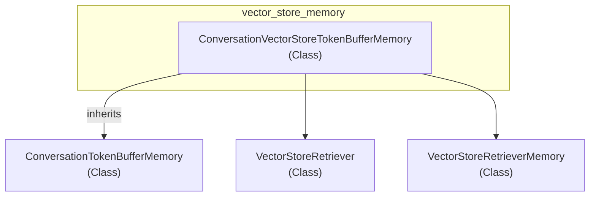

# vector_store_memory
The `vector_store_memory` module provides `ConversationVectorStoreTokenBufferMemory`, a chat memory class that combines recent conversation with historical context retrieved from a vector store, managing token limits.

<!-- DIAGRAM_JSON
{
  "nodes": [
    {"id": "vector_store_memory", "label": "vector_store_memory", "type": "Module"},
    {"id": "ConversationVectorStoreTokenBufferMemory", "label": "ConversationVectorStoreTokenBufferMemory", "type": "Class"},
    {"id": "ConversationTokenBufferMemory", "label": "ConversationTokenBufferMemory", "type": "Class"},
    {"id": "VectorStoreRetriever", "label": "VectorStoreRetriever", "type": "Class"},
    {"id": "VectorStoreRetrieverMemory", "label": "VectorStoreRetrieverMemory", "type": "Class"}
  ],
  "edges": [
    {"source": "vector_store_memory", "target": "ConversationVectorStoreTokenBufferMemory", "type": "contains"},
    {"source": "ConversationVectorStoreTokenBufferMemory", "target": "ConversationTokenBufferMemory", "type": "inherits"},
    {"source": "ConversationVectorStoreTokenBufferMemory", "target": "VectorStoreRetriever", "type": "uses"},
    {"source": "ConversationVectorStoreTokenBufferMemory", "target": "VectorStoreRetrieverMemory", "type": "uses"}
  ],
  "groups": [
    {"id": "vector_store_memory", "label": "vector_store_memory", "nodes": ["ConversationVectorStoreTokenBufferMemory"]}
  ]
}
-->
