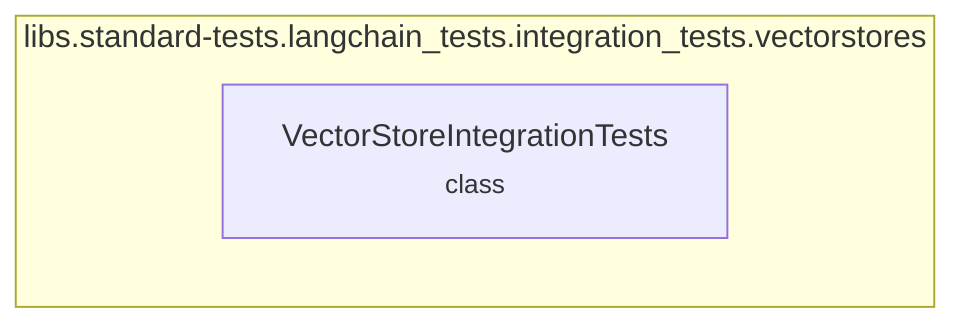

# vector_store_tests
This module provides `VectorStoreIntegrationTests`, a base class for standardizing integration tests across various vector store implementations.

<!-- DIAGRAM_JSON
{
  "nodes": [
    {
      "id": "A",
      "label": "VectorStoreIntegrationTests <small>class</small>"
    }
  ],
  "edges": [],
  "groups": [
    {
      "id": "libs.standard-tests.langchain_tests.integration_tests.vectorstores",
      "label": "libs.standard-tests.langchain_tests.integration_tests.vectorstores",
      "nodes": [
        "A"
      ]
    }
  ]
}
-->
