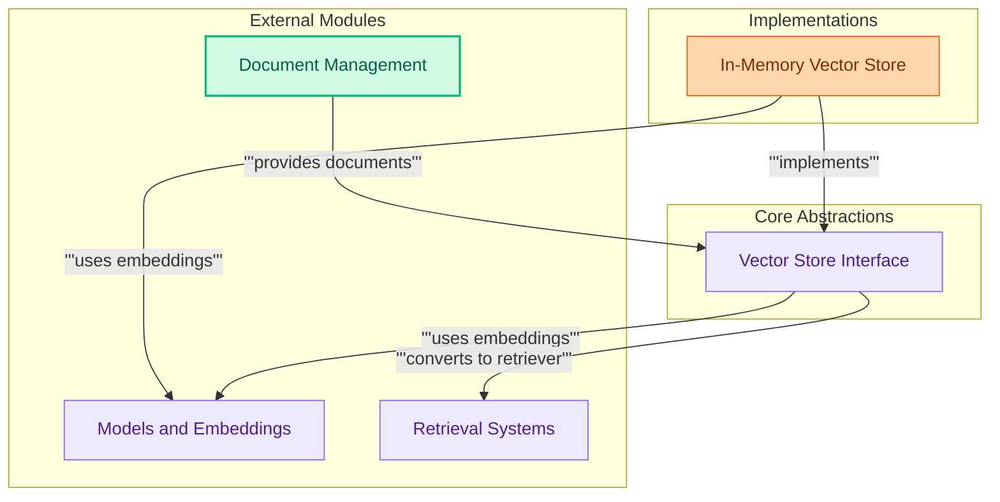

# Vector Stores
This module provides the foundational interfaces and an in-memory implementation for vector databases, enabling efficient storage, retrieval, and similarity search of document embeddings. It supports various search types and integration with embedding functions.

<!-- DIAGRAM_JSON
{
    "direction": "TD",
    "nodes": [
        {
            "id": "vector_stores",
            "label": "Vector Stores",
            "type": "module"
        },
        {
            "id": "vector_store_interface",
            "label": "Vector Store Interface",
            "type": "module",
            "link": "vector_store_interface.md"
        },
        {
            "id": "in_memory_store",
            "label": "In-Memory Vector Store",
            "type": "module",
            "link": "in_memory_store.md"
        },
        {
            "id": "models_and_embeddings",
            "label": "Models and Embeddings",
            "type": "external",
            "link": "models_and_embeddings.md"
        },
        {
            "id": "document_management",
            "label": "Document Management",
            "type": "external",
            "link": "document_management.md"
        },
        {
            "id": "retrieval_systems",
            "label": "Retrieval Systems",
            "type": "external",
            "link": "retrieval_systems.md"
        }
    ],
    "edges": [
        {
            "source": "in_memory_store",
            "target": "vector_store_interface",
            "label": "implements"
        },
        {
            "source": "vector_store_interface",
            "target": "models_and_embeddings",
            "label": "uses embeddings"
        },
        {
            "source": "in_memory_store",
            "target": "models_and_embeddings",
            "label": "uses embeddings"
        },
        {
            "source": "document_management",
            "target": "vector_store_interface",
            "label": "provides documents"
        },
        {
            "source": "vector_store_interface",
            "target": "retrieval_systems",
            "label": "converts to retriever"
        }
    ],
    "groups": [
        {
            "id": "core_abstractions",
            "label": "Core Abstractions",
            "role": "analytical",
            "nodes": [
                "vector_store_interface"
            ]
        },
        {
            "id": "implementations",
            "label": "Implementations",
            "role": "generative",
            "nodes": [
                "in_memory_store"
            ]
        },
        {
            "id": "external_modules",
            "label": "External Modules",
            "role": "surface",
            "nodes": [
                "models_and_embeddings",
                "document_management",
                "retrieval_systems"
            ]
        }
    ]
}
-->
```

