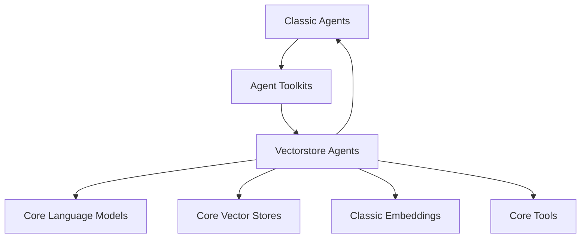

# Vectorstore Agents

## Introduction

The `vectorstore_agents` module provides utilities for creating agents that interact with vector stores. These agents can leverage vector databases to retrieve information and make decisions, enhancing their knowledge and capabilities. This module is part of the `langchain_classic.agents.agent_toolkits` and is designed to facilitate the integration of vector store functionalities into agent-based applications.

## Architecture

The `vectorstore_agents` module provides high-level functions to construct agents that utilize vector stores for information retrieval and routing. It builds upon core LangChain components for language models, vector stores, and tools.

<!-- DIAGRAM_JSON
{
    "direction": "TD",
    "nodes": [
        {"id": "classic_agents", "label": "Classic Agents", "type": "module", "link": "classic_agents.md"},
        {"id": "agent_toolkits", "label": "Agent Toolkits", "type": "module", "link": "agent_toolkits.md"},
        {"id": "vectorstore_agents", "label": "Vectorstore Agents", "type": "module", "link": "vectorstore_agents.md"},
        {"id": "core_language_models", "label": "Core Language Models", "type": "module", "link": "core_language_models.md"},
        {"id": "core_vectorstores", "label": "Core Vector Stores", "type": "module", "link": "core_vectorstores.md"},
        {"id": "classic_embeddings", "label": "Classic Embeddings", "type": "module", "link": "classic_embeddings.md"},
        {"id": "core_tools", "label": "Core Tools", "type": "module", "link": "core_tools.md"}
    ],
    "edges": [
        {"source": "classic_agents", "target": "agent_toolkits"},
        {"source": "agent_toolkits", "target": "vectorstore_agents"},
        {"source": "vectorstore_agents", "target": "core_language_models"},
        {"source": "vectorstore_agents", "target": "core_vectorstores"},
        {"source": "vectorstore_agents", "target": "classic_embeddings"},
        {"source": "vectorstore_agents", "target": "core_tools"},
        {"source": "vectorstore_agents", "target": "classic_agents"}
    ],
    "groups": []
}
-->

## Core Functionality

This module provides two primary functions for creating agents that interact with vector stores.

### `create_vectorstore_agent`

This function constructs a `VectorStore` agent from a `BaseLanguageModel` and a `VectorStoreToolkit`. It enables the agent to utilize tools provided by the toolkit to interact with a single vector store for information retrieval.

**Note**: This class is deprecated. The recommended approach involves using tool calling methods and LangGraph for more robust agent implementations.

**Arguments**:
- `llm`: The language model to be used by the agent (instance of `BaseLanguageModel`).
- `toolkit`: A set of tools (`VectorStoreToolkit`) that the agent will use to interact with the vector store.
- `callback_manager`: An optional object to handle callbacks during agent execution.
- `prefix`: An optional prefix prompt for the agent.
- `verbose`: A boolean indicating whether to display the content of the agent's scratchpad.
- `agent_executor_kwargs`: Optional keyword arguments to pass to the underlying `AgentExecutor`.
- `kwargs`: Additional named parameters to pass to the `ZeroShotAgent`.

**Returns**:
- An `AgentExecutor` object that can be called or used with the `run` method to get a response based on a query.

### `create_vectorstore_router_agent`

This function constructs a `VectorStore` router agent, designed to interact with multiple vector stores. It takes a `BaseLanguageModel` and a `VectorStoreRouterToolkit`, allowing the agent to intelligently route queries to the most appropriate vector store.

**Note**: This class is deprecated. Similar to `create_vectorstore_agent`, it is recommended to use tool calling methods and LangGraph for building router agents.

**Arguments**:
- `llm`: The language model to be used by the agent (instance of `BaseLanguageModel`).
- `toolkit`: A set of tools (`VectorStoreRouterToolkit`) with routing capabilities across multiple vector stores.
- `callback_manager`: An optional object to handle callbacks during agent execution.
- `prefix`: An optional prefix prompt for the router agent; defaults to `ROUTER_PREFIX`.
- `verbose`: A boolean indicating whether to display the content of the agent's scratchpad.
- `agent_executor_kwargs`: Optional keyword arguments to pass to the underlying `AgentExecutor`.
- `kwargs`: Additional named parameters to pass to the `ZeroShotAgent`.

**Returns**:
- An `AgentExecutor` object that can be called or used with the `run` method to get a response based on a query.
