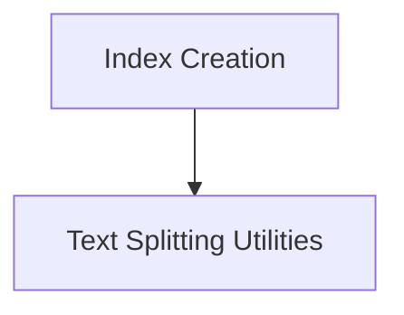

# Vectorstore Indexing Module

The `vectorstore_indexing` module provides the core functionality for creating and managing vector store indexes. These indexes are crucial for efficient semantic search and retrieval of documents based on their content.

## Architecture Overview

The module's architecture is centered around the `VectorstoreIndexCreator` which orchestrates the process of taking raw documents or loaded data, splitting them into manageable chunks using a `TextSplitter`, embedding these chunks using an `Embeddings` model, and finally storing them in a `VectorStore`. This structured approach ensures that documents are properly prepared and indexed for optimal retrieval performance.

<!-- DIAGRAM_JSON
{
    "direction": "TD",
    "nodes": [
        {"id": "index_creation", "label": "Index Creation", "type": "module", "link": "index_creation.md"},
        {"id": "text_splitting_utilities", "label": "Text Splitting Utilities", "type": "module", "link": "text_splitting_utilities.md"}
    ],
    "edges": [
        {"source": "index_creation", "target": "text_splitting_utilities"}
    ],
    "groups": []
}
-->

## Sub-modules

*   **[Index Creation](index_creation.md)**: This sub-module contains the primary class for initiating the vector store indexing process, handling the transformation of documents into an indexed vector store.

*   **[Text Splitting Utilities](text_splitting_utilities.md)**: This sub-module provides helper functions for breaking down large texts into smaller, more manageable segments suitable for embedding and indexing.