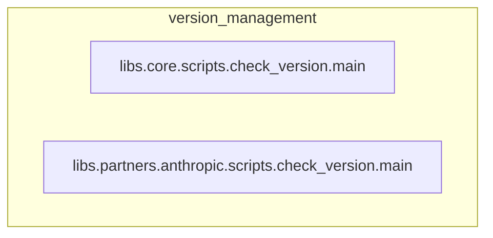

# version_management
This module provides scripts for validating version consistency across different sub-packages, ensuring that `pyproject.toml` and `version.py` files are synchronized.

<!-- DIAGRAM_JSON
{
    "nodes": [
        {
            "id": "A",
            "label": "libs.core.scripts.check_version.main",
            "type": "function"
        },
        {
            "id": "B",
            "label": "libs.partners.anthropic.scripts.check_version.main",
            "type": "function"
        }
    ],
    "edges": [],
    "groups": [
        {
            "id": "G1",
            "label": "version_management",
            "nodes": [
                "A",
                "B"
            ]
        }
    ]
}
-->
