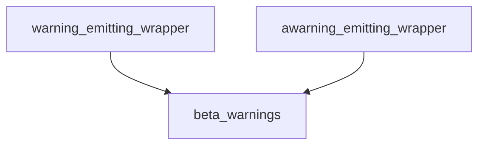

# `warning_emitting_wrappers_core`

This module provides core functionality for creating wrappers that emit warnings when a wrapped function or coroutine is called. It is primarily used for signaling the use of beta features or deprecated functionality within the `langchain_core` API.

## Architecture and Component Relationships

This module contains the fundamental synchronous and asynchronous warning-emitting wrappers. These wrappers rely on helper functions, likely provided by the parent `beta_warnings` module, to determine when and how to emit warnings.

<!-- DIAGRAM_JSON
{
    "direction": "TD",
    "nodes": [
        {"id": "sync_wrapper", "label": "warning_emitting_wrapper", "type": "component", "link": null},
        {"id": "async_wrapper", "label": "awarning_emitting_wrapper", "type": "component", "link": null},
        {"id": "beta_warnings_module", "label": "beta_warnings", "type": "external", "link": "beta_warnings.md"}
    ],
    "edges": [
        {"source": "sync_wrapper", "target": "beta_warnings_module"},
        {"source": "async_wrapper", "target": "beta_warnings_module"}
    ],
    "groups": []
}
-->



## Core Functionality

The module exposes two key wrappers:

### `warning_emitting_wrapper`

```python
        def warning_emitting_wrapper(*args: Any, **kwargs: Any) -> Any:
            """Wrapper for the original wrapped callable that emits a warning.

            Args:
                *args: The positional arguments to the function.
                **kwargs: The keyword arguments to the function.

            Returns:
                The return value of the function being wrapped.
            """
            nonlocal warned
            if not warned and not is_caller_internal():
                warned = True
                emit_warning()
            return wrapped(*args, **kwargs)
```

This synchronous wrapper wraps a callable, ensuring that a warning is emitted only once per wrapped instance and only if the caller is not considered "internal" to the system. After the check, it proceeds to call the original `wrapped` function.

### `awarning_emitting_wrapper`

```python
        async def awarning_emitting_wrapper(*args: Any, **kwargs: Any) -> Any:
            """Same as warning_emitting_wrapper, but for async functions."""
            nonlocal warned
            if not warned and not is_caller_internal():
                warned = True
                emit_warning()
            return await wrapped(*args, **kwargs)
```

This asynchronous wrapper provides identical functionality to `warning_emitting_wrapper` but is designed for wrapping `async` functions. It also ensures a single warning emission per instance, conditional on the caller not being internal, before awaiting the original `wrapped` coroutine.

## Integration with the System

This module is a leaf component within the `core_api.beta_warnings.function_warning_wrappers` hierarchy. It forms the foundation for applying warning mechanisms to individual functions and coroutines. It relies on the higher-level [beta_warnings](beta_warnings.md) module for the `emit_warning` and `is_caller_internal` logic, which defines the conditions and specifics of how warnings are generated and managed across the core API. This allows for consistent and controlled warning dissemination for features in beta or undergoing deprecation.
