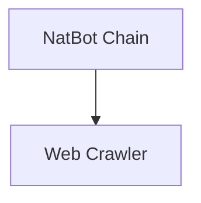

# Web Automation Chains Module

## Introduction
The `web_automation_chains` module provides components for automating web interactions using Large Language Models (LLMs). It enables an LLM to control a web browser, perform actions like navigation, clicking, and typing, and extract information from web pages to achieve a specified objective.

## Architecture Overview
The module is composed of two primary sub-modules: `NatBotChain` and `Crawler`. The `NatBotChain` acts as the orchestrator, leveraging an LLM to determine the next browser command based on an objective and the current browser state. The `Crawler` module provides the underlying web interaction capabilities, using a browser automation library (Playwright) to perform actions and extract content from web pages.

<!-- DIAGRAM_JSON
{
    "direction": "TD",
    "nodes": [
        {"id": "natbot_chain_module", "label": "NatBot Chain", "type": "module", "link": "natbot_chain_module.md"},
        {"id": "crawler_module", "label": "Web Crawler", "type": "module", "link": "crawler_module.md"}
    ],
    "edges": [
        {"source": "natbot_chain_module", "target": "crawler_module"}
    ],
    "groups": []
}
-->

## Sub-modules

### [NatBot Chain](natbot_chain_module.md)
This sub-module implements the core logic for the LLM-driven browser. It takes an objective and browser content as input and, using an LLM, determines the next command to execute in the browser. It handles the parsing of LLM commands and maintains the state of previous commands.

### [Web Crawler](crawler_module.md)
This sub-module provides the foundational web crawling and interaction functionalities. It uses Playwright to control a headless or headed browser, allowing for navigation, scrolling, clicking on elements, typing into input fields, and extracting the visible elements of a web page.