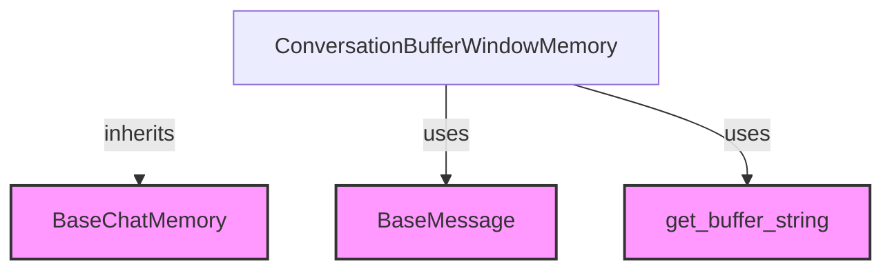

# `window_buffer_memory`

This module provides the `ConversationBufferWindowMemory` class, a specialized memory component designed to retain a sliding window of the most recent conversation turns. It is crucial for applications that require a limited, dynamic history of interactions, preventing the memory from growing indefinitely and ensuring focus on recent context.

## Architecture and Core Components

The `window_buffer_memory` module primarily consists of the `ConversationBufferWindowMemory` class, which extends `BaseChatMemory`. It manages conversation history by storing the last `k` turns, dropping older messages to maintain a fixed-size buffer.

<!-- DIAGRAM_JSON
{
    "direction": "TD",
    "nodes": [
        {"id": "conversation_buffer_window_memory", "label": "ConversationBufferWindowMemory", "type": "component", "link": null},
        {"id": "base_chat_memory", "label": "BaseChatMemory", "type": "external", "link": "classic_base_memory.md"},
        {"id": "base_message", "label": "BaseMessage", "type": "external", "link": "core_messages.md"},
        {"id": "get_buffer_string", "label": "get_buffer_string", "type": "external", "link": "core_messages.md"}
    ],
    "edges": [
        {"source": "conversation_buffer_window_memory", "target": "base_chat_memory", "label": "inherits"},
        {"source": "conversation_buffer_window_memory", "target": "base_message", "label": "uses"},
        {"source": "conversation_buffer_window_memory", "target": "get_buffer_string", "label": "uses"}
    ],
    "groups": []
}
-->

### Component: `ConversationBufferWindowMemory`

`ConversationBufferWindowMemory` is a memory management class designed to maintain a conversational history within a specified window size. It inherits from [`BaseChatMemory`](classic_base_memory.md) and provides mechanisms to store and retrieve recent messages, making it ideal for managing context in interactive AI systems.

#### Key Features:

*   **Windowed Buffer**: Stores only the last `k` conversational turns, discarding older messages to manage memory usage and focus on the most recent interactions.
*   **Flexible Output**: The buffer can be retrieved either as a concatenated string or as a list of `BaseMessage` objects, depending on the `return_messages` setting.
*   **Configurable Prefixes**: Allows customization of `human_prefix` and `ai_prefix` for formatting string-based conversation history.
*   **Memory Key**: Uses `memory_key` (default: "history") to define where the conversation buffer is stored within the memory variables.

#### Properties:

*   `human_prefix` (str): Prefix for human messages in the string buffer. Default is "Human".
*   `ai_prefix` (str): Prefix for AI messages in the string buffer. Default is "AI".
*   `memory_key` (str): The key under which the conversation history is stored in the memory dictionary. Default is "history".
*   `k` (int): The maximum number of messages (turns) to store in the buffer. If `k=0`, no messages are stored.
*   `buffer` (str | list[BaseMessage]): Returns the conversation buffer, either as a string or a list of messages, based on `return_messages`.
*   `buffer_as_str` (str): Explicitly returns the conversation buffer as a formatted string. It uses `get_buffer_string` (from [`core_messages`](core_messages.md)) for formatting.
*   `buffer_as_messages` (list[BaseMessage]): Explicitly returns the conversation buffer as a list of `BaseMessage` objects.
*   `memory_variables` (list[str]): Returns a list containing the `memory_key`.

#### Methods:

*   `load_memory_variables(inputs: dict[str, Any]) -> dict[str, Any]`: Returns a dictionary containing the current conversation buffer under the specified `memory_key`.

## Relationships with Other Modules

*   **[`classic_base_memory`](classic_base_memory.md)**: `ConversationBufferWindowMemory` inherits from `BaseChatMemory`, establishing its foundational memory management capabilities.
*   **[`core_messages`](core_messages.md)**: This module depends on `BaseMessage` for representing individual chat messages and utilizes `get_buffer_string` for formatting the conversational history into a readable string format.

## How it Fits into the System

The `window_buffer_memory` module is a core component within the `classic_memory` ecosystem, specifically under `buffer_memory`. It provides a practical and efficient solution for maintaining short-term conversational context in applications where full conversation history is not required or feasible. By limiting the memory to a window, it helps manage computational resources and keeps the AI focused on recent interactions, which is particularly useful in chatbot interfaces or agents with limited attention spans.
