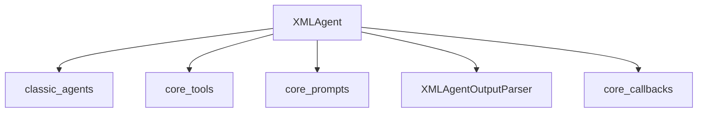

# xml_agent_class Module Documentation

The `xml_agent_class` module provides the `XMLAgent` class, a specialized agent designed to interact with Large Language Models (LLMs) using XML-formatted prompts and parsing XML outputs. This agent is particularly useful for scenarios where structured communication with an LLM is desired, leveraging XML tags for tool calls and final answers.

## Purpose and Core Functionality

The primary purpose of the `XMLAgent` is to enable agents to reason and act by formatting inputs as XML and parsing outputs structured in XML. This approach ensures a clear and unambiguous exchange of information between the agent's logic and the LLM, making it robust for complex multi-step reasoning and tool utilization.

Key functionalities include:
-   **Structured Interaction**: Uses XML tags (`<tool>`, `<tool_input>`, `<observation>`, `<final_answer>`) to define the structure of prompts and expected responses.
-   **Tool Utilization**: Integrates with various tools by embedding tool names and inputs within XML tags for the LLM to process.
-   **Asynchronous and Synchronous Planning**: Supports both `plan` (synchronous) and `aplan` (asynchronous) methods for determining the next action based on intermediate steps and LLM responses.
-   **Default Prompt and Output Parsing**: Provides static methods to retrieve a default `ChatPromptTemplate` and an `XMLAgentOutputParser` for standardized behavior.

## Architecture and Component Relationships

The `xml_agent_class` module primarily contains the `XMLAgent` class, which serves as a concrete implementation of an agent that leverages XML for communication. It integrates with several core LangChain components for its operation.

<!-- DIAGRAM_JSON
{
    "direction": "TD",
    "nodes": [
        {"id": "xml_agent", "label": "XMLAgent", "type": "component", "link": null},
        {"id": "xml_output_parser", "label": "XMLAgentOutputParser", "type": "component", "link": null},
        {"id": "classic_agents", "label": "classic_agents", "type": "external", "link": "classic_agents.md"},
        {"id": "core_tools", "label": "core_tools", "type": "external", "link": "core_tools.md"},
        {"id": "core_prompts", "label": "core_prompts", "type": "external", "link": "core_prompts.md"},
        {"id": "core_callbacks", "label": "core_callbacks", "type": "external", "link": "core_callbacks.md"}
    ],
    "edges": [
        {"source": "xml_agent", "target": "classic_agents"},
        {"source": "xml_agent", "target": "core_tools"},
        {"source": "xml_agent", "target": "core_prompts"},
        {"source": "xml_agent", "target": "xml_output_parser"},
        {"source": "xml_agent", "target": "core_callbacks"}
    ],
    "groups": []
}
-->

### Core Components

#### `XMLAgent`

`libs.langchain.langchain_classic.agents.xml.base.XMLAgent`

The `XMLAgent` class is a concrete implementation of `BaseSingleActionAgent` that facilitates LLM interaction using XML for structuring inputs and parsing outputs. It manages the agent's workflow by integrating tools, generating prompts, and processing LLM responses.

**Attributes:**

*   **`tools`**: A list of `BaseTool` instances that the agent can utilize to perform actions.
*   **`llm_chain`**: An `LLMChain` instance responsible for calling the LLM to predict the next action.

**Key Methods:**

*   **`input_keys`**: A property that returns the input keys expected by the agent, which is `["input"]`.
*   **`get_default_prompt()`**: A static method that provides a default `ChatPromptTemplate` tailored for XML-based agent instructions. It uses `AIMessagePromptTemplate` to structure intermediate steps.
*   **`get_default_output_parser()`**: A static method that returns an `XMLAgentOutputParser` instance, used to parse the XML-formatted output from the LLM into `AgentAction` or `AgentFinish` objects.
*   **`plan(intermediate_steps, callbacks, **kwargs)`**: The synchronous planning method. It constructs an XML-formatted prompt including the current question, available tools, and intermediate steps, then sends it to the `llm_chain` to determine the next action (`AgentAction`) or final answer (`AgentFinish`).
*   **`aplan(intermediate_steps, callbacks, **kwargs)`**: The asynchronous counterpart to `plan`, performing the same logic but awaiting the `llm_chain` call.

### Relationships with Other Modules

*   **[classic_agents](classic_agents.md)**: `XMLAgent` extends `BaseSingleActionAgent` from the `classic_agents` module, inheriting its fundamental agent capabilities and types like `AgentAction` and `AgentFinish`.
*   **[core_tools](core_tools.md)**: The agent relies on `BaseTool` instances for defining the actions it can perform, which are managed within the `core_tools` module.
*   **[core_prompts](core_prompts.md)**: `XMLAgent` utilizes `ChatPromptTemplate` and `AIMessagePromptTemplate` from `core_prompts` to construct the LLM prompts.
*   **[core_callbacks](core_callbacks.md)**: The `plan` and `aplan` methods accept `Callbacks` from `core_callbacks` to allow for monitoring and intervention during the agent's execution.
*   **`XMLAgentOutputParser`**: While not explicitly documented as a separate module, this class is conceptually a part of the XML agent's ecosystem, responsible for interpreting the LLM's XML output. It is tightly coupled with `XMLAgent`.

## How the Module Fits into the Overall System

The `xml_agent_class` module, and specifically the `XMLAgent`, is a specialized agent within the broader `classic_agents` framework. It resides under `classic_agents.structured_agents.xml_agents.xml_agent_core`, indicating its role as a core component for XML-based agents.

This module provides a robust and structured way to build agents that require precise control over LLM input and output formats, making it suitable for tasks demanding clarity and adherence to a defined protocol. It can be integrated into larger systems as a specific agent type for complex reasoning, especially when the underlying LLM performs well with XML-formatted instructions. It works in conjunction with other LangChain components like `LLMChain` for LLM interaction and various tools for extending its capabilities.