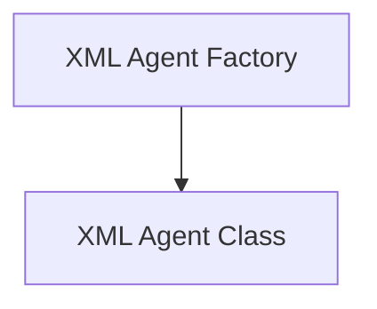

# XML Agent Core Module

This module provides the foundational components for creating agents that interact using XML-formatted messages. It includes the core `XMLAgent` class and a factory function `create_xml_agent` to facilitate the construction and deployment of such agents within the LangChain framework.

## Architecture Overview

The `xml_agent_core` module is composed of two primary sub-modules:

1.  **XML Agent Class**: Defines the structure and behavior of an XML-based agent.
2.  **XML Agent Factory**: Provides a convenient way to instantiate and configure XML agents.

These sub-modules work together to enable structured agent interactions, where actions, observations, and final answers are encapsulated within XML tags.

<!-- DIAGRAM_JSON
{
    "direction": "TD",
    "nodes": [
        {"id": "xml_agent_class", "label": "XML Agent Class", "type": "module", "link": "xml_agent_class.md"},
        {"id": "xml_agent_factory", "label": "XML Agent Factory", "type": "module", "link": "xml_agent_factory.md"}
    ],
    "edges": [
        {"source": "xml_agent_factory", "target": "xml_agent_class"}
    ],
    "groups": []
}
-->

## Sub-modules

### [XML Agent Class](xml_agent_class.md)
This sub-module defines the core `XMLAgent` class, which is a `BaseSingleActionAgent` designed for agents that communicate and plan using XML tags. It includes methods for planning actions based on intermediate steps and tool descriptions, and for asynchronously planning. The agent uses an `LLMChain` to predict the next action and an `XMLAgentOutputParser` to process the LLM's output.

### [XML Agent Factory](xml_agent_factory.md)
This sub-module provides the `create_xml_agent` function, a utility for easily constructing a `Runnable` sequence that acts as an XML agent. It allows for the configuration of an LLM, a sequence of tools, and a prompt template. The factory handles the rendering of tools into a string format, incorporates stop sequences for better LLM control, and integrates an `XMLAgentOutputParser` for structured output. This function simplifies the process of setting up XML-based agents by abstracting away much of the boilerplate.