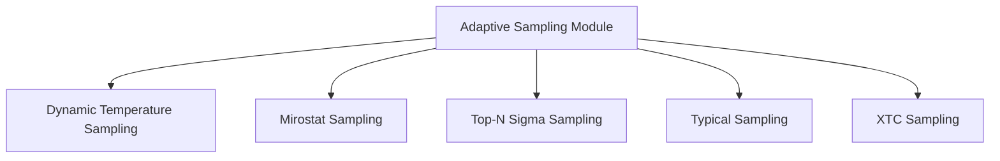

# Adaptive Sampling Module Documentation

## Introduction

The `adaptive_sampling` module, part of the `llama_cpp_sampling.core_sampling_techniques` family, is responsible for implementing various advanced and adaptive strategies for token sampling during text generation. These techniques go beyond basic sampling methods by dynamically adjusting parameters like temperature, top-k, or probability distributions based on the context and statistical properties of the token logits. This allows for more controlled, coherent, and diverse text outputs.

## Architecture Overview

This module integrates several distinct adaptive sampling techniques. Each technique operates on the `llama_token_data_array` structure, modifying token probabilities or filtering candidates before a final token is selected. The architecture is designed to allow flexible application of these methods based on desired generation characteristics.

<!-- DIAGRAM_JSON
{
    "direction": "TD",
    "nodes": [
        {"id": "dynamic_temperature_sampling", "label": "Dynamic Temperature Sampling", "type": "module", "link": "dynamic_temperature_sampling.md"},
        {"id": "mirostat_sampling", "label": "Mirostat Sampling", "type": "module", "link": "mirostat_sampling.md"},
        {"id": "top_n_sigma_sampling", "label": "Top-N Sigma Sampling", "type": "module", "link": "top_n_sigma_sampling.md"},
        {"id": "typical_sampling", "label": "Typical Sampling", "type": "module", "link": "typical_sampling.md"},
        {"id": "xtc_sampling", "label": "XTC Sampling", "type": "module", "link": "xtc_sampling.md"}
    ],
    "edges": [
        {"source": "adaptive_sampling_main", "target": "dynamic_temperature_sampling"},
        {"source": "adaptive_sampling_main", "target": "mirostat_sampling"},
        {"source": "adaptive_sampling_main", "target": "top_n_sigma_sampling"},
        {"source": "adaptive_sampling_main", "target": "typical_sampling"},
        {"source": "adaptive_sampling_main", "target": "xtc_sampling"}
    ],
    "groups": []
}
-->

## Sub-modules and Core Functionality

The `adaptive_sampling` module comprises the following key sub-modules, each implementing a distinct adaptive sampling algorithm:

*   ### [Dynamic Temperature Sampling](dynamic_temperature_sampling.md)
    This sub-module implements a sampling technique that dynamically adjusts the temperature parameter based on the entropy of the current token distribution. This allows for more adaptive control over the randomness of generated tokens, balancing exploration and exploitation.

*   ### [Mirostat Sampling](mirostat_sampling.md)
    This sub-module provides implementations for Mirostat v1 and Mirostat v2 sampling. These methods aim to control the "perplexity" or "surprise" of generated text by dynamically adjusting the sampling distribution to maintain a target level of information content.

*   ### [Top-N Sigma Sampling](top_n_sigma_sampling.md)
    This sub-module implements a sampling strategy that prunes the token candidates based on their logit values relative to the mean and standard deviation of all logits. It retains only the tokens whose logits are within a specified number of standard deviations from the maximum logit, focusing on statistically significant candidates.

*   ### [Typical Sampling](typical_sampling.md)
    This sub-module focuses on selecting "typical" tokens by comparing each token's negative log probability to the overall entropy of the distribution. Tokens that are too "untypical" (i.e., have significantly different surprise values compared to the average surprise) are filtered out, promoting more coherent and less surprising text.

*   ### [XTC Sampling](xtc_sampling.md)
    This sub-module implements an experimental context-truncation (XTC) sampling method. It prunes the token data array based on a probability and a threshold, potentially reducing the candidate pool to tokens with higher probabilities, thereby influencing the diversity and focus of the generated text.
