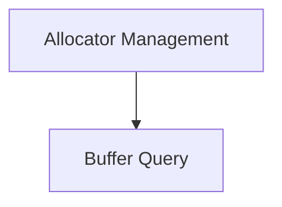

# Allocator Lifecycle Module Documentation

## Introduction

The `allocator_lifecycle` module is responsible for managing the lifecycle of the GGML graph allocator, including its creation, freeing, and querying buffer sizes. It provides the core functions for memory management within the GGML backend system, specifically interacting with `ggml_gallocr_t` instances.

## Architecture Overview

The `allocator_lifecycle` module is a crucial part of the `ggml_allocator` parent module, focusing on the fundamental operations related to graph allocator instances. It interacts with lower-level GGML buffer management utilities to perform its functions.

<!-- DIAGRAM_JSON
{
    "direction": "TD",
    "nodes": [
        {"id": "allocator_management", "label": "Allocator Management", "type": "module", "link": "allocator_management.md"},
        {"id": "buffer_query", "label": "Buffer Query", "type": "module", "link": "buffer_query.md"}
    ],
    "edges": [
        {"source": "allocator_management", "target": "buffer_query"}
    ],
    "groups": []
}
-->

## Sub-modules

*   ### Allocator Management ([allocator_management.md](allocator_management.md))
    This sub-module handles the creation (`ggml_gallocr_new`) and destruction (`ggml_gallocr_free`) of the GGML graph allocator. It ensures proper resource allocation and deallocation for efficient memory usage.

*   ### Buffer Query ([buffer_query.md](buffer_query.md))
    This sub-module provides functionality to query the size of allocated buffers within the GGML graph allocator (`ggml_gallocr_get_buffer_size`). It allows for introspection into the memory consumption of the allocator.

