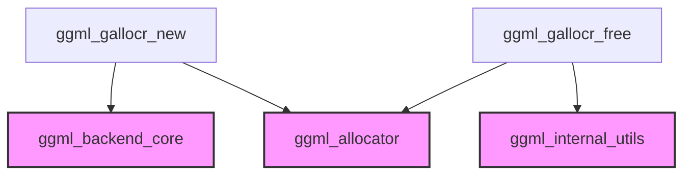

# Module: `allocator_lifecycle_management`

## Introduction
The `allocator_lifecycle_management` module is responsible for the creation and destruction of `ggml_gallocr_t` graph allocators. It provides core functions to instantiate a new allocator and to meticulously free all associated resources, ensuring efficient memory management within the GGML backend.

## Architecture and Component Relationships

This module plays a critical role in the memory management subsystem of GGML, specifically handling the lifecycle of graph allocators. It interfaces with the GGML backend to understand buffer types and relies on internal GGML utilities for memory deallocation and hash set management.

The `ggml_gallocr_new` function initializes a new graph allocator based on a specified backend buffer type. Conversely, `ggml_gallocr_free` systematically deallocates all buffers, dynamic tensor allocators, hash sets, and other data structures associated with a given graph allocator instance.

<!-- DIAGRAM_JSON
{
    "direction": "TD",
    "nodes": [
        {"id": "ggml_gallocr_new", "label": "ggml_gallocr_new", "type": "component", "link": null},
        {"id": "ggml_gallocr_free", "label": "ggml_gallocr_free", "type": "component", "link": null},
        {"id": "ggml_backend_core", "label": "ggml_backend_core", "type": "external", "link": "ggml_backend_core.md"},
        {"id": "ggml_allocator", "label": "ggml_allocator", "type": "external", "link": "ggml_allocator.md"},
        {"id": "ggml_internal_utils", "label": "ggml_internal_utils", "type": "external", "link": "ggml_internal_utils.md"}
    ],
    "edges": [
        {"source": "ggml_gallocr_new", "target": "ggml_backend_core"},
        {"source": "ggml_gallocr_new", "target": "ggml_allocator"},
        {"source": "ggml_gallocr_free", "target": "ggml_allocator"},
        {"source": "ggml_gallocr_free", "target": "ggml_internal_utils"}
    ],
    "groups": []
}
-->



## Core Functionality

### `ggml_gallocr_new`
This function is responsible for creating and initializing a new `ggml_gallocr_t` graph allocator. It acts as an entry point for setting up a new memory allocation context for GGML operations.

```c
ggml_gallocr_t ggml_gallocr_new(ggml_backend_buffer_type_t buft) {
    return ggml_gallocr_new_n(&buft, 1);
}
```

*   **Parameters**:
    *   `buft`: A `ggml_backend_buffer_type_t` enumerating the type of backend buffer to be used for the allocator. This type is critical for the allocator to correctly interface with the underlying GGML backend for memory provisioning. (Refer to [ggml_backend_core](ggml_backend_core.md) for more details on backend buffer types).
*   **Returns**: A pointer to the newly created `ggml_gallocr_t` instance.
*   **Purpose**: Simplifies the creation of a single graph allocator by wrapping a call to `ggml_gallocr_new_n`.

### `ggml_gallocr_free`
This function deallocates all resources associated with a `ggml_gallocr_t` graph allocator, preventing memory leaks and ensuring proper cleanup.

```c
void ggml_gallocr_free(ggml_gallocr_t galloc) {
    if (galloc == NULL) {
        return;
    }

    for (int i = 0; i < galloc->n_buffers; i++) {
        if (galloc->buffers != NULL) {
            // skip if already freed
            bool freed = false;
            for (int j = 0; j < i; j++) {
                if (galloc->buffers[j] == galloc->buffers[i]) {
                    freed = true;
                    break;
                }
            }
            if (!freed) {
                ggml_vbuffer_free(galloc->buffers[i]);
            }
        }
        if (galloc->buf_tallocs != NULL) {
            // skip if already freed
            bool freed = false;
            for (int j = 0; j < i; j++) {
                if (galloc->buf_tallocs[j] == galloc->buf_tallocs[i]) {
                    freed = true;
                    break;
                }
            }
            if (!freed) {
                ggml_dyn_tallocr_free(galloc->buf_tallocs[i]);
            }
        }
    }

    ggml_hash_set_free(&galloc->hash_set);
    free(galloc->hash_values);
    free(galloc->bufts);
    free(galloc->buffer_sizes);
    free(galloc->buffers);
    free(galloc->buf_tallocs);
    free(galloc->node_allocs);
    free(galloc->leaf_allocs);
    free(galloc);
}
```

*   **Parameters**:
    *   `galloc`: A pointer to the `ggml_gallocr_t` instance to be freed.
*   **Purpose**: Iterates through all buffers and dynamic tensor allocators managed by the `galloc` instance, ensuring each is freed only once. It also deallocates the associated hash set and all internal arrays used by the allocator, finally freeing the allocator structure itself. It relies on internal functions like `ggml_vbuffer_free` and `ggml_dyn_tallocr_free` (which are part of the larger [ggml_allocator](ggml_allocator.md) context) and `ggml_hash_set_free` (refer to [ggml_internal_utils](ggml_internal_utils.md)).

## How the Module Fits into the Overall System
The `allocator_lifecycle_management` module is a fundamental part of the `ggml_allocator` system, providing the essential capabilities for managing the lifespan of graph allocators. It ensures that memory resources are properly acquired when a graph allocator is needed and released cleanly when it is no longer in use. This systematic approach to resource management is crucial for the stability and performance of applications leveraging the GGML library, especially in contexts with dynamic memory allocation patterns and varying backend requirements. It directly supports the `allocator_management` module by offering the primitive operations for allocator creation and destruction.
