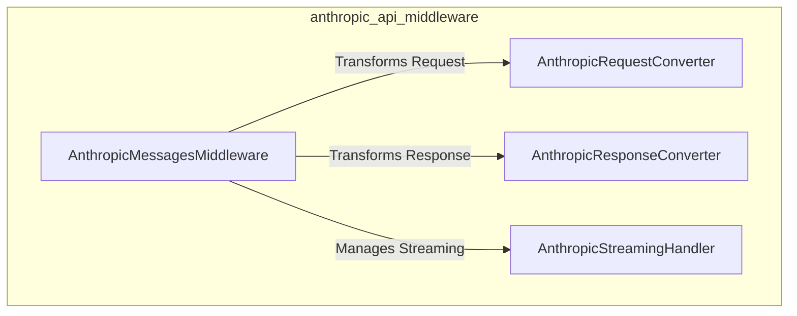

# anthropic_api_middleware
A Gin middleware module designed to translate incoming Anthropic API requests into an internal format (e.g., Ollama) and convert internal responses back into Anthropic API format.

<!-- DIAGRAM_JSON
{
  "nodes": [
    {
      "id": "A",
      "label": "AnthropicMessagesMiddleware"
    },
    {
      "id": "B",
      "label": "AnthropicRequestConverter"
    },
    {
      "id": "C",
      "label": "AnthropicResponseConverter"
    },
    {
      "id": "D",
      "label": "AnthropicStreamingHandler"
    }
  ],
  "edges": [
    {
      "source": "A",
      "target": "B",
      "label": "Transforms Request"
    },
    {
      "source": "A",
      "target": "C",
      "label": "Transforms Response"
    },
    {
      "source": "A",
      "target": "D",
      "label": "Manages Streaming"
    }
  ],
  "groups": [
    {
      "id": "anthropic_api_middleware",
      "label": "anthropic_api_middleware",
      "members": ["A", "B", "C", "D"]
    }
  ]
}
-->
