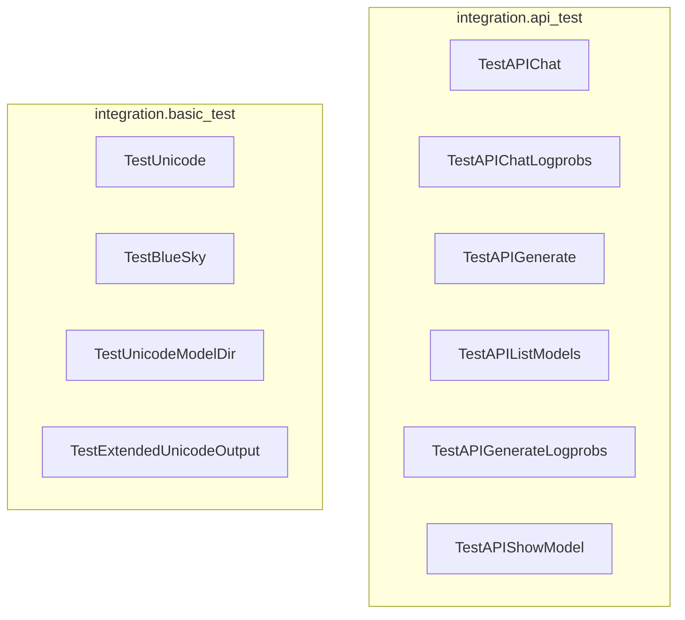

# api_and_core_tests
This module contains integration tests for the API and core functionalities, covering chat, generation, model management, and unicode handling.

<!-- DIAGRAM_JSON
{
  "nodes": [
    {"id": "TestAPIChat", "label": "TestAPIChat"},
    {"id": "TestAPIChatLogprobs", "label": "TestAPIChatLogprobs"},
    {"id": "TestAPIGenerate", "label": "TestAPIGenerate"},
    {"id": "TestAPIListModels", "label": "TestAPIListModels"},
    {"id": "TestAPIGenerateLogprobs", "label": "TestAPIGenerateLogprobs"},
    {"id": "TestAPIShowModel", "label": "TestAPIShowModel"},
    {"id": "TestUnicode", "label": "TestUnicode"},
    {"id": "TestBlueSky", "label": "TestBlueSky"},
    {"id": "TestUnicodeModelDir", "label": "TestUnicodeModelDir"},
    {"id": "TestExtendedUnicodeOutput", "label": "TestExtendedUnicodeOutput"}
  ],
  "edges": [],
  "groups": [
    {"id": "integration.api_test", "label": "integration.api_test", "nodes": ["TestAPIChat", "TestAPIChatLogprobs", "TestAPIGenerate", "TestAPIListModels", "TestAPIGenerateLogprobs", "TestAPIShowModel"]},
    {"id": "integration.basic_test", "label": "integration.basic_test", "nodes": ["TestUnicode", "TestBlueSky", "TestUnicodeModelDir", "TestExtendedUnicodeOutput"]}
  ]
}
-->
